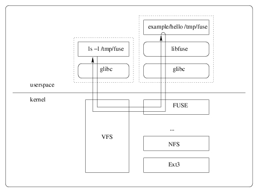

## Цель

Цель этой работы — получить понимание того, как ОС взаимодейтсвует с файловой системой на примере работы реализации виртуальной файловой системы с помощью библиотеки FUSE.

В результате ее выполнения будут получены базовые знания библиотеки FUSE, а также произойдет овладение концепциями, связанными с реализацией файловых систем.

## Задание

Написать на языке С программу с помощью библиотеки [FUSE](http://fuse.sourceforge.net/), которая подключает виртуальную файловую систему, дерево директорий которой (полученное с помощью команды `tree`) задано ниже.

Файловая система содержит 4 директории: `foo`, `bar`, `baz` и `bin`,— а также 4 файла, из которых 3 — текстовые файлы: `example`, `readme.txt`, `test`,— и 1 бинарный (содержимое бинарного файла должно быть взято из соответствующей стандартной системной утилиты, название которой соответствует названию файла: `ls`, `grep`, `pwd`,...) Содержимое остальных файлов:

- `readme.txt`: Student <имя и фамилия>, <номер зачетки>
- `test.txt`: <Любой текст на ваш выбор с количеством строк равным последним двум цифрам номера зачетки>
- `example`: Hello world

Файловая система должна монтироваться в папку `/mnt/fuse/`, после чего должна быть возможность осуществить листинг ее директорий и просмотр содержимого виртуальных файлов. При обращении к файловой системе должны проверяться права доступа (маска прав указана в дереве директорий через слеш после имени файла). Владельцем всех файлов должен быть текущий пользователь, который выполняет монтирование системы.

## Литература

- <https://github.com/libfuse/libfuse>
- [Разработка собственной файловой системы с помощью FUSE](http://www.ibm.com/developerworks/ru/library/l-fuse/)
- [Учебник по FUSE](http://wiki.linuxformat.ru/wiki/LXF76:%D0%A3%D1%87%D0%B5%D0%B1%D0%BD%D0%B8%D0%BA_Fuse)
