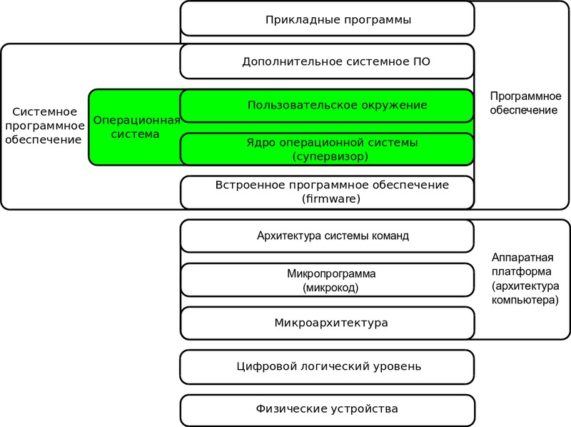
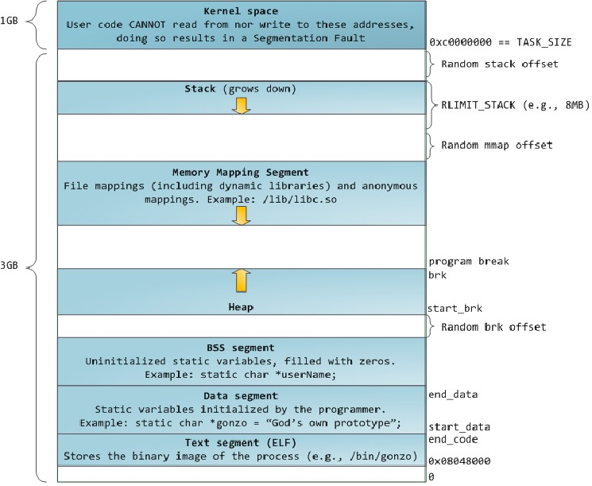
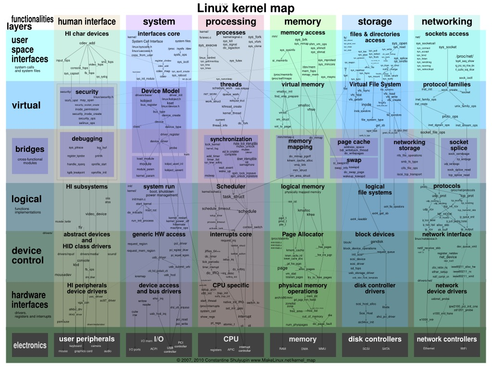
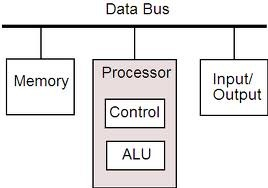
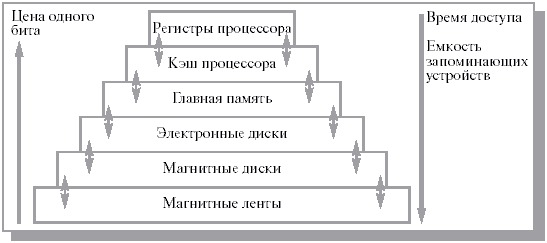
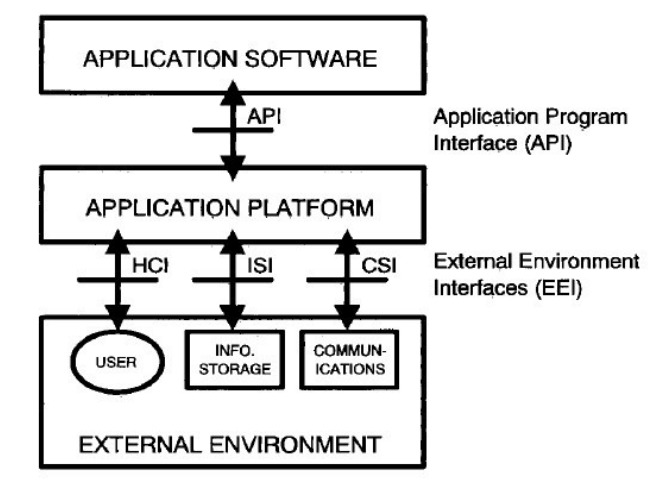

## ОС

ОС — это комплекс управляющих и обрабатывающих программ, которые, с одной стороны, выступают как **интерфейс** между устройствами вычислительной системы и прикладными программами, а с другой стороны — предназначены для **управления** устройствами и вычислительными процессами, эффективного распределения **ресурсов** между вычислительными процессами и организации надёжных вычислений.

### Задачи ОС:

- управление аппаратной частью (менеджер ресурсов)
- абстракция аппаратной части (виртуальная машина)
- изоляция приложений от аппаратной части (во избежание порчи)

## Программа в памяти

### Программа Hello World:

    #include <stdio.h>
    #include <unistd.h>

    int main ()
    {
        printf("Hello World");
        exit(0);
    }

### Один из вариантов дизассемблирования:

    .section .rodata
    .LC0:
        .string “Hello World”
    
    .text
    .globl  main
    .type   main,@function
    main:
        pushl    %ebp
        movl     %esp, %ebp
        subl     $8, %esp
        subl     $12, %esp
        pushl    $.LC0
        call     printf
        addl     $16, %esp
        subl     $12, %esp
        pushl    $0
        call     exit

## Ядро ОС

Ядро ОС — это центральная часть операционной системы, обеспечивающая приложениям координированный доступ к ресурсам компьютера, таким как процессорное время, память, внешнее аппаратное обеспечение, внешнее устройство ввода и вывода информации. Также обычно ядро предоставляет сервисы файловой системы и сетевых протоколов.

Ядро — тоже программа.

### Варианты реализации ядра:

- монолитное: одна монолитная программа в памяти — +простота, +скорость, -ошибки, -перекомпиляция
- модульное: монолитная программа, предоставляющая интерфейс загрузки и выгрузки доп.модулей — снимает проблему перекомпиляции
- микроядро: несколько программ, которые взаимодействуют через передачу сообщений — +изоляция, +слабая связность, -сложность, -скорость
- наноядро: ядро только управляет ресурсами (обработка прерываний)
- экзоядро: наноядро с координацией работы процессов
- гибридное

TODO: Дебаты Торвальдса и Танненбаума

## Аппаратная архитектура

### Различные архитектуры:

- фон Неймана
- Гарвардская
- стековые машины
- Lisp Machine
- FPGA
- и другие

### Архитектура фон Неймана

### Принципы фон Неймана:

- Двоичного кодирования 
  
	Согласно этому принципу, вся информация, поступающая в ЭВМ, кодируется с помощью двоичных сигналов (двоичных цифр, битов) и разделяется на единицы, называемые словами.

- Однородности памяти 

	Программы и данные хранятся в одной и той же памяти. Поэтому ЭВМ не различает, что хранится в данной ячейке памяти — число, текст или команда. Над командами можно выполнять такие же действия, как и над данными.

- Адресуемости памяти 

	Структурно основная память состоит из пронумерованных ячеек; процессору в произвольный момент времени доступна любая ячейка. Отсюда следует возможность давать имена областям памяти, так, чтобы к хранящимся в них значениям можно было бы впоследствии обращаться или менять их в процессе выполнения программы с использованием присвоенных имен.

- Последовательного программного управления 

	Предполагает, что программа состоит из набора команд, которые выполняются процессором автоматически друг за другом в определенной последовательности.

- Жесткости архитектуры 

	Неизменяемость в процессе работы топологии, архитектуры, списка команд.

### Von Neumann Bottleneck:

Совместное использование шины для памяти программ и памяти данных приводит к узкому месту архитектуры фон Неймана, а именно ограничению пропускной способности между процессором и памятью по сравнению с объемом памяти. Из-за того, что память программ и память данных не могут быть доступны в одно и то же время, пропускная способность является значительно меньшей, чем скорость, с которой процессор может работать. Это серьезно ограничивает эффективное быстродействие при использовании процессоров, необходимых для выполнения минимальной обработки на больших объемах данных. Процессор постоянно вынужден ждать необходимых данных, которые будут переданы в память или из памяти. Так как скорость процессора и объем памяти увеличивались гораздо быстрее, чем пропускная способность между ними, узкое место стало большой проблемой, серьезность которой возрастает с каждым новым поколением процессоров.

## Архитектура x86

<http://en.wikibooks.org/wiki/X86_Assembly/X86_Architecture>

### Основные особенности:

- набор инструкций процессора (CICS), инструкции двух типов: арифметико-логические (ADD, AND, ...) и управляющие (MOV, JMP, ...)
- ограниченное количество регистров: несколько регистров общего назначения (A, B, C, D), размер которых равен длине машинного слова, и несколько специальных регистров (IP, FLAGS, ...). АЛУ процессора может работать только с регистрами общего назначения. УУ процессора занимается модификацией значений регистров или перемещением данных между регистрами и памятью

### Режимы работы процессора:

- реальный: прямая адресация памяти
- защищенный: косвенная адресация памяти с использованием модуля управления памятью (MMU)
- и другие вспомагательные

### Работа процессора:

    while (1) {
        execute_instruction(read_memory(IP));
        // IP - регистр-указатель инструкции 
    }

## Виртуальная машина

Виртуальная машина — это (эффективный) изолированный дупликат реальной машины.

[Критерии эффективной виртуализации Попека-Голдберга](http://en.wikipedia.org/wiki/Popek_and_Goldberg_virtualization_requirements)

### Возможные задачи:

- эмуляция различных архитектур
- реализация языка программирования
- увеличение переносимости кода
- исследования производительности ПО или новой компьютерной архитектуры
- оптимизации использования ресурсов компьютеров
- защита информации и ограничение возможностей программ (песочница)
- внедрение вредоносного кода для управления инфицированной системой
- моделирование информационных систем различных архитектур на одном компьютере
- упрощение администрирования

### Типы:

- Системная (гипервизор)
- Процессная

### Типы гипервизоров:

- автономный
- на основе базовой ОС
- гибридный

## POSIX

POSIX - Portable Operating System Interface for Unix — Переносимый интерфейс операционных систем Unix — набор стандартов, описывающих интерфейсы между операционной системой и прикладной программой.

Открытые стандарты — это стандарты, которые публикуются в открытых источниках и, как правило, имеют одну или несколько (часто обязательным является наличие минимум двух) эталонных реализаций (reference implementation). Также, как правило, такие стандарты разрабатываются в рамках четко определенного процесса.

Интерфейс — совокупность правил (описаний, соглашений, протоколов), обеспечивающих взаимодействие устройств и программ в вычислительной системе или сопряжение между системами. Это внешнее представление, абстракция какого-то информационного объекта. Интерфейс разделяет методы внешнего взаимодействия и внутренней работы. Один объект может иметь несколько интерфейсов для разных "потребителей". Интерфейс — это средство трансляции между сущностями внешней и внутренней для объекта среды. Интерфейс — это форма косвенного взаимодействия. Связанно с концепцией кибернетики "черный ящик".

Протокол — набор соглашений интерфейса логического уровня, которые определяют обмен данными между различными программами. Эти соглашения задают единообразный способ передачи сообщений и обработки ошибок при взаимодействии программного обеспечения разнесённой в пространстве аппаратуры, соединённой тем или иным интерфейсом. Это набор правил взаимодействия между объектами. Эти правила определяют синтаксис, семантику и синхронизацию взаимодействия. Протокол может существовать в форме конвенции (неформального) или стандарта (формального набора правил).

### Задачи POSIX:

- содействовать облегчению переноса кода прикладных программ на иные платформы
- способствовать определению и унификации интерфейсов заранее при проектировании, а не в процессе их реализации
- сохранить по возможности и учитывать все главные, созданные ранее и используемые прикладные программы
- определять необходимый минимум интерфейсов прикладных программ, для ускорения создания, одобрения и утверждения документов
- развивать стандарты в направлении обеспечения коммуникационных сетей, распределенной обработки данных и защиты информации
- рекомендовать ограничение использования бинарного (объектного) кода для приложений в простых системах

### Принципы открытой системы:

- переносимость приложений (на уровнях: кода и программы), данных и персонала
- интероперабельность
- расширяемость
- масштабируемость

## Фольклор

Системное программирование — одна из старейших областей компьютерной инженерии. Поэтому она включает в себя не только формальные знания, такие как алгоритмы, стандарты и результаты исследований, но также и накопленные неформальные, культурные и социальные знания.

### Примеры:

- Закон Постела (принцип здравости) — относится к организации взаимодействия между системами. Один из приципов, лежащих в основе Интернета

	> Будьте консервативны в том, что отправляете, и либеральны в том, что принимаете.

- Закон конвертирования программ Завинского — описывает развитие любой сложной программной системы

	> Каждая программа пытается расшириться до тех пор, пока не сможет читать почту. Те программы, которые не могут этого сделать, заменяются теми, которые могут.

- Десятое правило программирования Гринспена — описывает развитие любой сложной программной системы, основанной на статических языках

	> Любая достаточно сложная программа на C или Fortran содержит реализацию половины Common Lisp, которая является ad hoc, наформально-специфицированной, полной багов и медленной.

## Литература

- [A Crash Course in Modern Hardware](http://www.infoq.com/presentations/click-crash-course-modern-hardware)
- [The C Programming Language](http://citeseerx.ist.psu.edu/viewdoc/download?doi=10.1.1.126.4437&rep=rep1&type=pdf) или [Learn C The Hard Way](http://c.learncodethehardway.org/book/)
- [The Unix Programming Environment](http://netlib.bell-labs.com/cm/cs/upe/)
