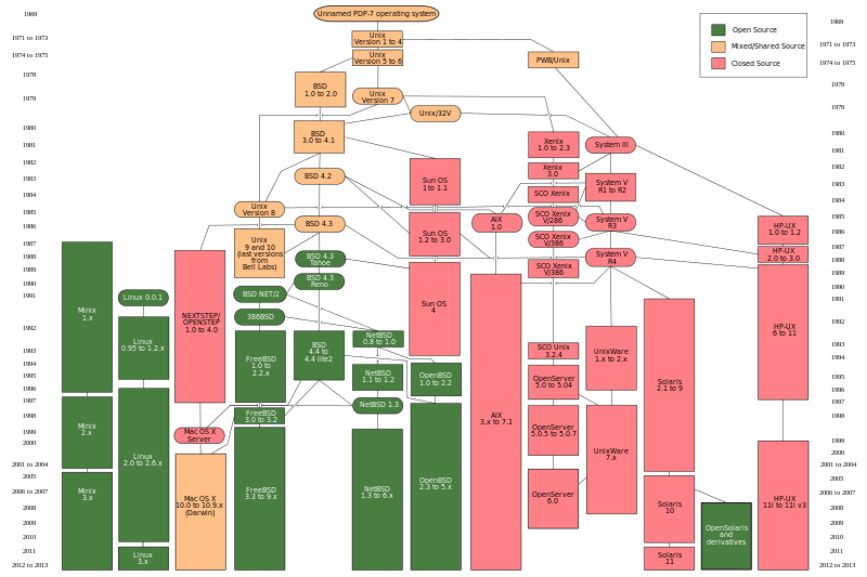
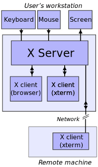

## Історія Unix

UNIX з'явився в 1973 (почав розроблятися в 1969) в Bell Labs. Перша цільова платформа — мінікомп'ютери DEC (PDP-7).

В Unix були створені такі технології, як: мова C, оператор `pipe` (`|`) для взаємодії між процесами, інтерфейс сокетів BSD та багато інших.

UNIX спочатку був умовно відкритою системою, досить зручною для портування на інші архітектури. Тому досить швидко з'явилися різні гілки (варіанти) Unix'ів. Першою такою гілкою (fork'ом) став Берклевскій дистрибутив (BSD) в 1977 році. У той же час, ліцензія UNIX не давала можливості необмеженої зміни і модифікації системи, з чим були пов'язані багато юридичних конфліктів. У решті решт, на даний момент сформувалося кілька закритих комерційних версій Unix'а, кілька відкритих версій, а також ряд Unix-подібних систем, створених з нуля (насамперед, GNU/Linux).

## Основні варіації Unix'ів

### Комерційні варіації

Комерційні версії Unix ведуть свій родовід від т.зв. Unix System V. Практично всі вони припинили свій розвиток. Основні представники:

- SCO UnixWare (припинений)
- Sun Solaris (припинений)
- IBM AIX
- HP-UX

На даний момент розвивається в якості ОС для дата-центрів тільки illumos — відкритий спадкоємець Sun Solars, який був найпросунутішої і активно змінюємою версією Unix'а.

Ключові технології illumos:

- ФС ZFS
- Технолония ізоляції та створення т.зв. пісочниць Solaris Zones
- Система інтроспекції DTrace
- Технологія віртуалізації Kernel Virtual Machine

### Варіанти BSD

Берклевскій дистрибутив розвивався як альтернатива System V Unix і з моменту виходу в світ версії 4.3 Tahoe став повністю відкритим і безкоштовним. З дистрибутивами BSD пов'язана одна з найпоширеніших open-source ліцензій — ліцензія BSD. BSD-версії Unix продовжують активно розвиватися.

Представники BSD сімейства:

- FreeBSD
- OpenBSD
- NetBSD
- DragonflyBSD

На основі дистрибутива FreeBSD було створено ядро Darwin, яке використовується в MacOS X.

:br

### GNU/Linux

Linux — це Unix і не Unix — повністю нова система, створена на основі принципів Unix, як їх розумів Лінус Торвальдс. Поштовхом для написання системи стали поширення навчального варіанту Unix'а MINIX, створеного Таненбаумом, а також поява процесора Intel 386 з підтримкою плоскою сегментной моделі, що радикально спростило написання ядра ОС.

Linux обійшов інші варіанти Unix'а на хвилі open-source за рахунок використання напрацювань руху GNU (компілятор gcc, утиліти core-utils, редактор Emacs та ін.) та ліцензії GPL, яка вимагає відкриття доробок системи на тих же умовах, що і оригінальної системи.

Linux — це ядро, на основі якого створюється дистрибутив — набір системних утиліт та інших програм, необхідних для роботи системи, таких як графічна оболонка, офісні додатки і т.п. Існують десятки дистрибутивів GNU/Linux, серед яких найбільш поширені гілки Red Hat (Red Hat Enterprise Linux, Fedora, Suse, CentOS) і Debian (Debian, Ubuntu, Mint).

Специфічним дистрибутивом Linux є ОС Google Android.

### Plan 9

Plan 9 була академічної спробою в рамках лабораторії Bell Labs створити спадкоємця Unix, в якому б були виправлені його основні недоліки. Вона виявилася класичним прикладом синдрому "другої системи", і не набула поширення.

Ключові рішення:

- Все — дійсно файл
- Окремі простори імен
- Скасування суперкористувача

## Ключові рішення Unix

- відкрита система (man, POSIX, open source)
- файл-центричність і текст-центричність
     - "Small pieces, loosely joined"
     - розвинені засоби IPC
- ієрархічна файлова система з примітивною моделлю безпеки
- плоске API системних викликів, засноване на C
     - додаткові можливості заховані в ioctl, fnctl, і т.п.
- користувач root
- модель запуску процесів fork / exec
- розвинена система управління залежностями

## Підтримка GUI в Unix

Історично ядро Unix розроблялося без підтримки графічного інтерфейсу, який на той момент ще не був розвинений. По міру розвитку різних варіантів графічної апаратної частини в Unix було створено рішення для підтримки і роботи з ними — протокол X11, розроблений робочою групою в університеті MIT.

X11 протокол має різні реалізації:

- xfree86
- X.org
- Wayland

На базі X11 протоколу, як правило, будуються більш високоуровенвие графічні фреймворки (GUI toolkits). Найпоширеніші фреймворки в Unix-середовищі:

- GTK
- Qt

Віконні менеджери вирішують задачу управління інтерфейсом додатків в рамках єдиної концепції (на даний момент прийнята концепція Робочого столу або [WIMP](http://en.wikipedia.org/wiki/WIMP_%28computing%29)). Як правило, менеджери вікон будуються на основі графічних фреймворків. Наприклад, найпоширеніший менеджер Gnome використовує GTK, KDE побудований на основі Qt.

Інші менеджери вікон:

- звичайні: Xfce, Sawfish
- плиткові: ion3, XMonad

### Управління залежностями

В умовах створення нових додатків з використанням створеної раніше бази програмних бібліотек, важливим і складним завданням, яке вирішує будь-який дистрибутив Unix (а також, на даний момент і середовища всіх мов програмування), є управління залежностями. Для цього (майже) кожен дистрибутив Unix має спеціальну програму — пактений менеджер, який відповідає за ведення бази існуючих бібліотек і їх версій, залежностей і сумісності між версіями, а також місць зберігання вихідного чи об'єктного коду, з яких можна завантажити ту чи іншу версію.

Розрізняють менеджери залежностей, які працюють на рівні вихідного коду (з його наступною збіркою) і на рівні бінарних файлів.

Найпоширеніші пакетні менеджери:

- менеджери на основі формату APT в Debian
- менеджери на основі формату RPM в Red Hat
- BSD ports і система Portage Gentoo Linux

Також, більшість середовищ мов програмування надають свій особливий менеджер пакетів. Наприклад:

- Maven в Java
- RubyGems в Ruby
- NPM в Node.js

### Принципи розробки під Unix

У книзі "Мистецтво програмування під Unix" ([TAOUP] (http://catb.org/esr/writings/taoup/)) Ерік Реймонд сформулював наступні принципи хорошого тону, які переважно застосовуються при розробці як самих частин Unix систем, так і програм для Unix:

- Модульності (Modularity): створювати прості частини, що зв'язуються чистими інтерфейсами
- Ясності (Clarity): ясні рішення краще хитрих і розумних
- Композиції (Composition): створювати програми, які можуть бути пов'язаними з іншими програмами
- Поділу (Separation): розділяти політику і механізм, інтерфейс і реалізацію
- Простоти (Simplicity): придумувати найпростіше рішення, додавати складність тільки по необхідності
- Ощадливості (Parsimony): створювати великі програми, тільки коли продемонстровано, що інші не впораються
- Прозорості (Transparency): продумувати програми з тим, щоб зробити інтроспецкцію і відлагодження можливими і максимально простими
- Міцності (Robustness): міцність — це дитя прозорості та простоти
- Представлень (Representation): вкладати знання в дані, щоб логіка програми була тупою і надійною
- Найменшого подиву (Least Surprise): при проектуванні інтерфейсів завжди потрібно вибирати найменш несподіваний варіант
- Тиші (Silence): коли у програми немає нічого дивного, щоб повідомити, вона не має повідомляти нічого
- Полагодження (Repair): намагатися полагодити все, що можна, але коли це не вдається — падати, падати голосно і якомога раніше
- Економії (Economy): час програміста дорого коштує, його краще зберегти і витратити машинний час
- Генерації (Generation): по можливості уникати кодування, коли можна написати програму, яка буде писати інші програми
- Оптимізації (Optimization): прототипувати перед шліфуванням, домогтися роботи програми перед її оптимізацією
- Розмаїття (Diversity): не довіряти ніяким твердженнями про єдиний вірноий шлях
- Розширюваності (Extensibility): проектувати на майбутнє — воно настане раніше, ніж ми думаємо

### Критика Unix

Поряд з фанатами Unix існують і Unix-ненависники, які навіть написали власну книгу — [Керівництво Unix-ненависників](http://web.mit.edu/simsong/www/ugh.pdf).

Ось деякі типові претензії до Unix систем:

- слабка підтримка GUI
- слабка підтримка сценаріїв роботи звичайного користувача (т.зв. Desktop сценарії)
- недостатнє дотримання моделі "все — файл"
- примітивна модель безпеки: простий ACL, користувач root
- примітивна файлова система
- додаткові можливості заховані в ioctl, fnctl, ...
- застаріла системна мова (C)

## Література

- [The Art of Unix Programming](http://catb.org/esr/writings/taoup/)
- [The UNIX-HATERS Handbook](http://web.mit.edu/simsong/www/ugh.pdf)
- [The Daemon, the GNU & the Penguin](http://www.groklaw.net/staticpages/index.php?page=20051013231901859)
