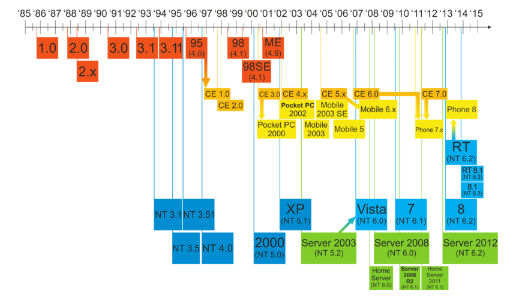
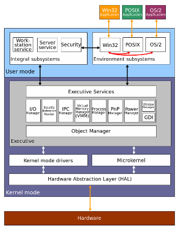

## Історія Windows

Windows — це сімейство ОС, яке розвивалося поступово, починаючи з переробки ОС CP/M в ОС MS-DOS. MS-DOS, як і CP/M, був примітивною однокористуацькою ОС для персональних комп'ютерів, які тільки з'являлися. Він був створений в рамках існуючих на той момент апаратних обмежень цих пристроїв (16-бітна архітектура, малі доступні ресурси, такі як потужність процесора, обсяги пам'яті і постійних сховищ). Спочатку ця система повинна була завантажуватися з дискет ємністю близько 750 Кб, працювати в текстовому графічному режимі і управляти пам'яттю до 1 МБ. Система Windows спочатку була графічною оболонкою над MS-DOS.

Разом з швидким розвитком можливостей ПК почала швидко розвиватися і Windows, незабаром впершись у обмеження своєї архітектури. Windows 95/98 стала 32-розрядною версією системи, яка ще не використала такі стандартні технології підтримки багатокористувацької роботи, як поділ на режим ядра і користувача, багатозадачність, ФС з поділом прав доступу і т.п.

Реалізацією сучасних концепцій ОС стало ядро Windows NT, яке послугувало основою систем Windows 2000/XP/7/8 і Windows Server.

## Windows NT

Windows NT — це назва сучасного ядра Windows.

Його основні характеристики:

- розділення на режим ядра і користувача
- гібридне ядро, що включає мікроядро, рівень абстракції пристроїв і драйверів (HAL) і сервіси ОС, що працюють в ядерному режимі (Executive), а також сервіси ОС, що працюють в користувацькому режимі: оточення (Environment) та інтеграції (Integral)
- підтримка витісняючої багатозадачності
- підтримка SMT/SMP
- виведення на основі пакетного та асинхронного режимів

Мікроядро виконує такі функції:

- синхронізація
- планування виконання ниток і обробки переривань
- перехоплення виключень
- ініціалізація драйверів при запуску системи

Виконавчі сервіси ОС (Executive) включають:

- введення-виведення (в т.ч. взаємодію з графічними пристроями через інтерфейс GDI)
- управління пристроями (в т.ч. живленням, підтримка Plug-n-play пристроїв)
- управління об'єктами ядерного режиму
- управління процесами і міжпроцесною взаємодією
- управління пам'яттю і кешами
- управління конфігурацією (через системний реєстр)
- безпека

Сервіси оточення ядра WinNT підтрумують 3 режими роботи:

- Win32-сумісний (з підтримкою MSDOS і Win16 додатків), що включає також віконний менеджер — сервіс csrss.exe
- Posix-сумісний
- OS/2-сумісний

## Ключові рішення Windows

- прив'язка до архітектури x86 (Windows не підтримує інших архітектур, крім ARM)
- GUI-центричність
- Windows API
- управління конфігурацією через реєстр
- велика увага зворотній сумісності
- системна мова C++, потім C#

## Критика Windows

- закрита система
- проблеми з композицією програм
- проблеми з безпекою
- непридатність для багатьох сценаріїв роботи (насамперед, як високопродуктивної серверної ОС)

## Література

- [Mark Russinovich & David Solomon - Windows Internals](http://technet.microsoft.com/en-us/sysinternals/bb963901.aspx)
- [The Infamous Windows "Hello World" Program](http://www.charlespetzold.com/blog/2014/12/The-Infamous-Windows-Hello-World-Program.html)
- [MS-DOS: A Brief Introduction](http://www.linfo.org/ms-dos.html)
- [How Microsoft Lost the API War](http://www.joelonsoftware.com/articles/APIWar.html)
