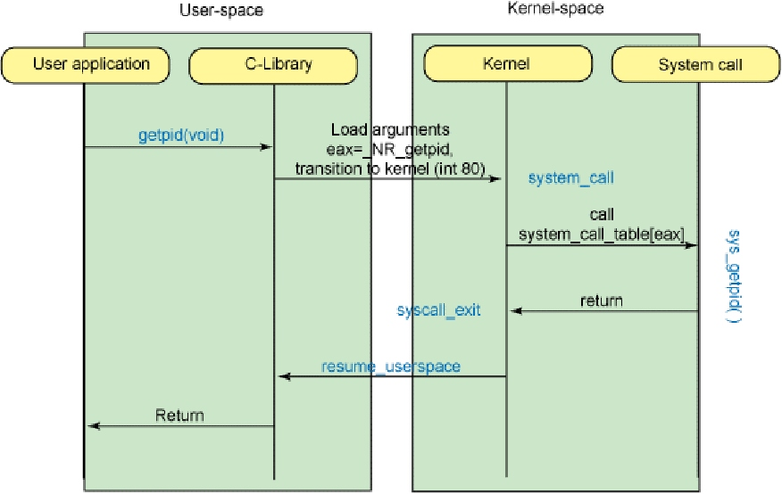

## Бінарний інтерфейс додатків (ABI)

Бінарний інтерфейс додатків — набір формальних специфікацій і неформальних угод в рамках програмної платформи, що забезпечують виконання програмам на платформі. Бінарному інтерфейсу мають слідувати всі програми, однак вся робота по його реалізації лягає на компілятор і, як правило, прозора для прикладних програмістів.

Бінарний інтерфейс включає:

- специфікацію типів даних: розміри, формат, послідовність байт (endiannes)
- формати виконуваних файлів
- угоди про виклики
- формат і номери системних викликів
- та ін.

## Асемблер

Асемблер — це низькорівнева мова, яка дозволяє безпосередньо кодувати інструкції програмної платформи (ОС або віртуальної машини).

Відмінності асемблера від мов більш високого рівня:

- відсутність єдиного стандарту, тобто у кожної архітектури свій асемблер
- програма на Асемблері досить прямо відображається в бінарний код об'єктного (виконуваного) файлу; зворотнє перетворення — з об'єктного файлу в асемблерний код називається дизасемблювання
- в асемблері немає поняття змінних, а також керуючих конструкцій: виконання програми відбувається за рахунок маніпуляції даними в регістрах і пам'яті безпосередньо, а також виклику інших інструкцій процесора
- відсутність будь-яких перевірок цілісності даних (наприклад, перевірки типів)

Синтаксис асемблера складають:

- літерали — константні значення, які представляють самі себе (числа, адреси, рядки, регістри)
- інструкції — мнемоніки для запису відповідних інструкцій процесора
- мітки — імена для адрес пам'яті
- директиви компілятора — інтсрукціі компілятору, що описують різні аспекти створення з програми виконуваного файлу (розрядність і секції програми, експортовані символи і т.д.) — не записуються безпосередньо у виконувану програму
- макроси — конструкції для запису послідовності блоків коду, в результаті виконання яких на етапі компіляції виконується підстановка цих шматків коду замість імені макросу

Загальноприйнятими є 2 синтаксису асемблера:

- AT&T
- Intel

Найбільш поширені асемблери для архітектури x86: NASM, GAS, MASM, TASM. Частина з них є крос-платформеними, тобто працюють в різних ОС, а частина — тільки в якій-небудь одній ОС або групі ОС.

### Адресація пам'яти

Асемблером підтримуються різні способи адресації пам'яті:

- безпосередня
- пряма (абсолютна)
- непряма (базова)
- автоінкрементна/автодекрементна
- регістрова
- відносна (у випадку використання сегментной організації віртуальної пам'яті)

Порядок байтів (endianness) в машинному слові визначає послідовність запису байтів: від старшого до молодшого (**big-endian**) або від молодшого до старшого (**little-endian**).

### Стек

(Більш правильна назва використовуваної структури даних — **стопка** або **магазин**. Однак, історично прижилося запозичена назва стек).

Стек (stack) — це частина динамічної пам'яті, яка використовується при виклику функцій для зберігання їх аргументів і локальних змінних. В архітектурі x86 стек росте вниз, тобто вершина стека має найменший адресу. Регістр `SP` (Stack Pointer) вказує на поточну вершину стека, а регістр `BP` (Base Pointer) вказує на т.зв. базу, яка використовується для розділення стека на логічні частини, що відносяться до однієї функції — **фрейми** (кадри). Крім операцій звернення до пам'яті безпосередньо, які можуть застосуються в тому числі для роботи зі стеком, додатково для нього також введені інструкції `push` і `pop`, які записують дані на вершину стека і зчитують дані з вершини, після чого видаляють. Ці операції здійснюють зміну регістру `SP`.

Як правило, програми на високорівневих мовах програмування не працюють зі стеком безпосередньо, а це робить за них компілятор, реалізуючи певні угоди про виклики функцій і способи зберігання локальних змінних. Однак стандартна функція `alloca` бібліотеки `stdlib` дозволяє програмно виділяти пам'ять на стеку.

Виклик функції високорівневої мови створює на стеку новий фрейм, який містить аргументи функції, адресу повернення з функції, покажчик на початок попереднього фрейму, а також місце під локальні змінні.

На початку роботи програми в стеку виділений тільки 1 фрейм для функції `main` і її аргументів — числового значення `argc` і масиву покажчиків змінної довжини `argv`, кожен з яких записується на стек окремо, а також змінних оточення.

## Угоди про виклики

Угода про виклики — це схема, у відповідності з якою виклик функції високорівневої мови програмування реалізується в виконуваному коді. Угода про виклики відповідає на питання:

- Як передаються аргументи і повертаються значення? Вони можуть передаватися або в регістрах, або через стек, або і так, і так.
- Як розподіляється робота (по маніпуляції стеком викликів) між викликаючою і викликаної стороною?

В принципі, угоди не є жорстким стандартом, і програма не зобов'язана слідувати тій чи іншій угоді для власних функцій (тому програми на асемблері не завжди слідують йому), однак компілятори створюють виконувані файли у відповідності з тою або іншою угодою. Крім того, угоди про виклики для бібліотечних функцій можуть відрізнятися від угоди для системних викликів: наприклад аргументи системних викликів можуть передаватися через регістри, а бібліотечних функцій — через стек.

Поширені угоди:

- `cdecl` — загальноприйнята угода для програм на мові С в архітектурі IA32: параметри кладуться на стек справа-наліво, викликаюча функція відповідає за очищення стека після повернення з викликаної функції
- `stdcall` — стандартна угоди для Win32: параметри кладуться на стек справа-наліво, функція може використовувати регістри `EAX`, `ECX` і `EDX`, викликана функція відповідає за очищення стека перед поверненням
- `fastcall` — нестандартні угоди, в яких передача одного або більше параметрів відбувається через регістри для прискорення виклику
- `pascal` — параметри кладуться на стек зліва-направо (протилежно `cdecl`) і викликана функція відповідає за очищення стека перед поверненням
- `thiscall` — угода для С++
- `safecall` — угода для COM/OLE
- `syscall`
- `optlink`
- AMD64 ABI
- Microsoft x86 calling convention

Приклад виклику згідно до угоди `cdecl`:

Код на мові С:

    // викликана функція
    int callee(int a, int b, int c) {
       int d;
       d = a + b + c;
       ...
       return d;
    }

    // викликаюча функція
    int caller(void) {
        int rez = callee(1, 2, 3);
        return rez + 5;
    }

Згенерований компілятором асемблерний код:

    // в викликаючій функції
    pushl   %ebp  // збереження покажчика на попередній фрейм
    movl    %esp,%ebp
    // запис аргументів у стек справа-наліво
    pushl   $3
    pushl   $2
    pushl   $1
    call    callee
    addl    $12,%esp // очистка стека
    addl    $5,%eax // результат виклика — в регістрі EAX
    leave
    ret

    // у викликаній функції calee(1, 2, 3)
    subl $4,%esp // виділення месця під змінну d
    movl %eax,4(%ebp) // дістаємо аргумент a
    movl %ecx,8(%ebp) // дістаємо аргумент b
    addl %eax,%ecx // результат додавання залишається в %eax
    movl %ecx,12(%ebp) // дістаємо аргумент c
    addl %eax,%ecx // результат додавання залишається в %eax
    movl (%esp),%eax // присвоюємо значення d
    // ...
    movl %eax,(%esp) // записуємо d в %eax
    leave // эквівалент movl $ebp,$esp; pop $ebp
    ret

## Системні виклики

Загалом, **системний виклик** — це довільна функція, яка реалізується ядром ОС і доступна для виклику з програми користувача. При виконанні системного виклику відбувається переключення контексту з користувацького в ядерний. Тому на рівні команд процесора системний виклик виконується не як звичайний виклик функції (інструкція `CALL`), а за допомогою програмного переривання (в Linux це переривання номер 80) або ж за допомогою інструкції `SYSENTER` (більш сучасний варіант).

Приклад виконання системного виклика `write` за допомогою програмного переривання:

	mov eax, 4        ; specify the sys_write function code
	                  ; (from OS vector table)
	mov ebx, 1        ; specify file descriptor stdout(1)
	mov ecx, str      ; move start address of string message
	                  ; to ecx register
	mov edx, str_len  ; move length of message (in bytes)
	int 80h           ; tell kernel to perform
	                  ; the system call we just set up

Приклад виконання системного виклика `write` за допомогою програмного інструкції `SYSENTER`:

    push str_len
    push str
    push 1
    push 4
    push ebp
    mov ebp, esp
    sysenter

Стандартна бібліотека `libc` реалізує свої функції понад системними викликами.

## Література

- [Ассемблер в Linux для программистов C](http://ru.wikibooks.org/wiki/%D0%90%D1%81%D1%81%D0%B5%D0%BC%D0%B1%D0%BB%D0%B5%D1%80_%D0%B2_Linux_%D0%B4%D0%BB%D1%8F_%D0%BF%D1%80%D0%BE%D0%B3%D1%80%D0%B0%D0%BC%D0%BC%D0%B8%D1%81%D1%82%D0%BE%D0%B2_C)
- [Ассемблеры для Linux: Сравнение GAS и NASM](http://www.ibm.com/developerworks/ru/library/l-gas-nasm/)
- [x86 Registers](http://www.eecg.toronto.edu/~amza/www.mindsec.com/files/x86regs.html)
- [Why Registers Are Fast and RAM Is Slow](http://www.mikeash.com/pyblog/friday-qa-2013-10-11-why-registers-are-fast-and-ram-is-slow.html)
- [Kernel command using Linux system calls](http://www.ibm.com/developerworks/library/l-system-calls/)
- [The Linux Kernel: System Calls](http://www.win.tue.nl/~aeb/linux/lk/lk-4.html)
- [Sysenter Based System Call Mechanism in Linux 2.6](http://articles.manugarg.com/systemcallinlinux2_6.html)
- [Kernel command using Linux system calls](http://www.ibm.com/developerworks/library/l-system-calls/)
- [Reverse Engineering for Beginners](http://yurichev.com/writings/RE_for_beginners-en.pdf)
