## Апаратне управління пам'яттю

Більшість комп'ютерів використовують велику кількість різних запам'ятовуючих пристроїв, таких як: ПЗУ, ОЗУ, жорсткі диски, магнітні носії і т.д. Всі вони являють собою види пам'яті, які доступні через різні інтерфейси. Два основних інтерфейсу — це пряма адресація процесором і файлові системи. Пряма адресація означає, що адреса комірки з даними може бути аргументом інструкцій процесора.

Режими роботи процесора x86:

- Реальний — прямий доступ до пам'яті з фізичного адресою
- Захищений — використання віртуальної пам'яті і кілець процесора для розмежування доступу до неї

## Віртуальна пам'ять

Віртуальна пам'ять — це підхід до управління пам'яттю комп'ютером, який приховує фізичну пам'ять (у різних формах, таких як: оперативна пам'ять, ПЗУ або жорсткі диски) за єдиним інтерфейсом, дозволяючи створювати програми, які працюють з ними як з єдиним безперервним масивом пам'яті з довільним доступом.

Нею вирішуються наступні завдання:

- підтримка ізоляції процесів і захисту пам'яті шляхом створення свого власного віртуального адресного простору для кожного процесу
- підтримка ізоляції області ядра від коду користувацького режиму
- підтримка пам'яті тільки для читання та з забороною на виконання
- підтримка вивантаження не використовуваних ділянок пам'яті в область підкачування на диску (свопінг)
- підтримка відображених в пам'ять файлів, в тому числі завантажувальних модулів
- підтримка розділяємої між процесами пам'яті, в тому числі з копіюванням-при-запису для економії фізичних сторінок

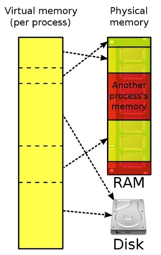

Види адрес пам'яті:

- фізична - адреса апаратної комірки пам'яті
- логічна - віртуальна адреса, якою оперує додаток

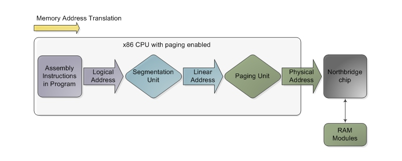

За рахунок наявності механізму віртуальної пам'яті компілятори прикладних програм можуть генерувати виконуваний код в рамках спрощеної абстрактної лінійної моделі пам'яті, в якій вся доступна пам'ять представляється у вигляді безперервного масиву [машинних слів](http://ru.wikipedia.org/wiki/%D0%9C%D0%B0%D1%88%D0%B8%D0%BD%D0%BD%D0%BE%D0%B5_%D1%81%D0%BB%D0%BE%D0%B2%D0%BE), що адресується з 0 до максимально можливої адреси для даної розрядності (`2^N`, де `N` — кількість біт, тобто для 32-розрядної архітектури максимальна адреса — `2^32` = `#FFFFFFFF`).
Це означає що результуючі програми не прив'язані до конкретних параметрах запам'ятовуючих пристроїв, таких як їх обсяг, режим адресації і т.д.

Крім того, цей додатковий рівень дозволяє через той же самий інтерфейс звернення до даних за адресою в пам'яті реалізувати інші функції, такі як звернення до даних у файлі (через механізм `mmap`) і т.д. Нарешті, він дозволяє забезпечити більш гнучке, ефективне і безпечне управління пам'яттю комп'ютера, ніж при використанні фізичної пам'яті безпосередньо.

На апаратному рівні віртуальна пам'ять, як правило, підтримується спеціальним пристроєм — [Модулем управління памяттю](http://en.wikipedia.org/wiki/Memory_management_unit).

## Сторінкова організація пам'яті

Сторінкова пам'ять — спосіб організації віртуальної пам'яті, при якому одиницею відображення віртуальних адрес на фізичні є регіон постійного розміру — сторінка.

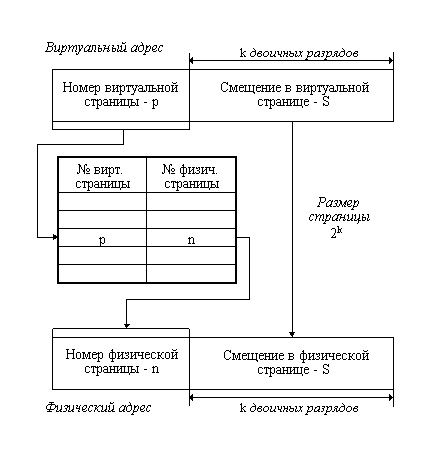

При використанні сторінкової моделі вся віртуальна пам'ять ділиться на N сторінок таким чином, що частина віртуального адреси інтерпретується як номер сторінки, а частина — як зміщення всередині сторінки. Вся фізична пам'ять також поділяється на блоки такого ж розміру — **фрейми**. Таким чином в один фрейм може бути завантажена одна сторінка. **Свопінг** — це вивантаження сторінки з пам'яті на диск (або інший носій більшого обсягу), який використовується тоді, коли всі фрейми зайняті. При цьому під свопінг потрапляють сторінки пам'яті неактивних на даний момент процесів.

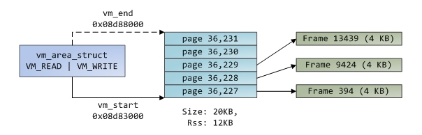

Таблиця відповідності фреймів і сторінок називається таблицею сторінок. Вона одна для всієї системи. Запис у таблиці сторінок містить службову інформацію, таку як: індикатори доступу тільки на читання або на читання/запис, чи знаходиться сторінка в пам'яті, чи проводився в неї запис і т.д. Сторінка може знаходиться в трьох станах: завантажена в пам'ять, вивантажена в своп, ще не завантажена в пам'ять (при початковому виділенні сторінки вона не завжди відразу розміщується в пам'яті).

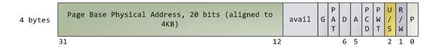

Розмір сторінки і кількість сторінок залежить від того, яка частина адреси виділяється на номер сторінки, а яка на зміщення. Приміром, якщо в 32-розрядній системі розбити адресу на дві рівні половини, то кількість сторінок буде становити 2^16, тобто 65536, і розмір сторінки в байтах буде таким же, тобто 64 КБ. Якщо зменшити кількість сторінок до 2^12, то в системі буде 4096 сторінки по 1МБ, а якщо збільшити до 2^20, то 1 мільйон сторінок за 4КБ. Чим більше в системі сторінок, тим більше займає пам'яті таблиця сторінок, відповідно робота процесора з нею сповільнюється. А оскільки кожне звернення до пам'яті вимагає звернення до таблиці сторінок для трансляції віртуального адреси, таке уповільнення дуже небажане. З іншого боку, чим менше сторінок і, відповідно, чим вони більші за обсягом — тим більше втрати пам'яті, викликані внутрішньою фрагментацією сторінок, оскільки сторінка є одиницею виділення пам'яті. У цьому полягає дилема оптимізації сторінкової пам'яті. Вона особливо актуальна при переході до 64-розрядних архітектур.

Для оптимізації сторінкової пам'яті використовуються наступні підходи:

- спеціальний кеш — TLB (translation lookaside buffer) — в якому зберігається дуже невелике число (поярдка 64) найбільш часто використовуваних адрес сторінок (основні сторінки, до яких постійно звертається ОС)
- багаторівнева (2, 3 рівня) таблиця сторінок — в цьому випадку віртуальна адреса розбивається не на 2, а на 3 (4, ...) частини. Остання частина залишається зміщенням всередині сторінки, а кожна з решти задає номер сторінки в таблиці сторінок 1-го, 2-го і т.д. рівнів. У цій схемі для трансляції адрес потрібно виконати не 1 звернення до таблиці сторінок, а 2 і більше. З іншого боку, це дозволяє свопити таблицю сторінок 2-го і т.д. рівнів, і довантажувати в пам'ять лише ті таблиці, які потрібні поточному процесу в поточний момент часу або ж навіть кешувати їх. А кожна з таблиць окремого рівня має суттєво менший розмір, ніж мала б одна таблиця, якби рівень був один

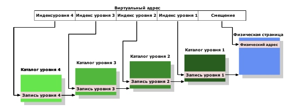

- інвертована таблиця сторінок — в ній стільки записів, скільки в системі фреймів, а не сторінок, і індексом є номер фрейму: а число фреймів в 64- і більше розрядних архітектурах істотно менше теоретично можливого числа сторінок. Проблема такого підходу — довгий пошук віртуального адреси. Вона вирішується за допомогою таких механізмів: хеш-таблиць або кластерних таблиць сторінок

:br

## Сегментна організація пам'яті

Сегментна організація віртуальної пам'яті реалізує наступний механізм: вся пам'ять ділитися на сегменти фіксованою або довільної довжини, кожний з яких характеризується своєю початковою адресою — **базою** або **селектором**. Віртуальна адреса в такій системі складається з двох компонент: **бази** сегмента, до якого ми хочемо звернутися, і **зміщення** всередині сегмента.

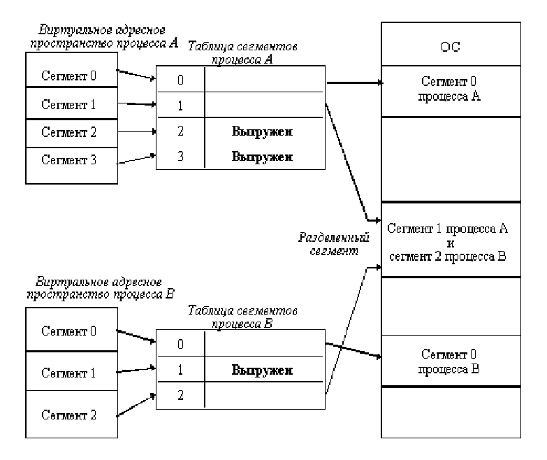

### Історична модель сегментації в архітектурі х86

В архітектурі х86 сегментна модель пам'яті була вперше реалізована на 16-розрядних процесорах 8086. Використання тільки 16 розрядів для адреси давало можливість адресувати тільки 2^16 байт, тобто 64КБ пам'яті. У той же час стандартний розмір фізичної пам'яті для цих процесорів був 1МБ. Для того, щоб мати можливість працювати з усім доступним обсягом пам'яті і була використана сегментна модель. В ній у процесора було виділено 4 спеціалізованих регістра CS (сегмент коду), SS (сегмент стека), DS (сегмент даних), ES (розширений сегмент) для зберігання бази поточного сегмента (для коду, стека і даних програми — 2 регістри — відповідно).

Фізична адреса в такій системі розраховується за формулою:

    addr = base << 4 + offset

Це призводило до можливості адресувати більші адреси, ніж 1МБ — т.зв. [Gate A20](http://en.wikipedia.org/wiki/Gate_A20#The_80286_and_the_high_memory_area).

Див. також: <http://en.wikipedia.org/wiki/X86_memory_segmentation>

### Плоска модель сегментації

32-розрядний процесор 386 міг адресувати 2^32 байт пам'яті, тобто 4ГБ, що більш ніж перекривало доступні на той момент розміри фізичної пам'яті, тому початкова причина для використання сегментної організації пам'яті відпала.

Однак, крім особливого способу адресації сегментна модель також надає механізм захисту пам'яті через **кільця безпеки процесора**: для кожного сегмента в таблиці сегментів задається значення допустимого рівня привілеїв (DPL), а при зверненні до сегменту передається рівень привілеїв поточної програми (запитаний рівень привілеїв, RPL) і, якщо `RPL> DPL` доступ до пам'яті заборонений. Таким чином забезпечується захист сегментів пам'яті ядра ОС, які мають `DPL = 0`. Також в таблиці сегментів задаються інші атрибути сегментів, такі як можливість запису в пам'ять, можливість виконання коду з неї і т.д.

Таблиця сегментів кожного процесу знаходиться в пам'яті, а її початкова адреса завантажується в регістр `LDTR` процесора. У регістрі `GDTR` процесора зберігається покажчик на глобальну таблицю сегментів.

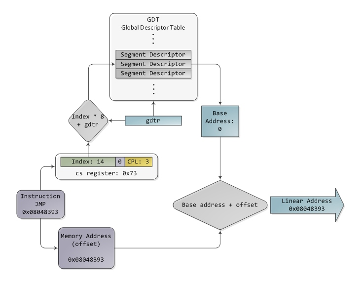

:br

## Віртуальна пам'ять в архітектурі x86

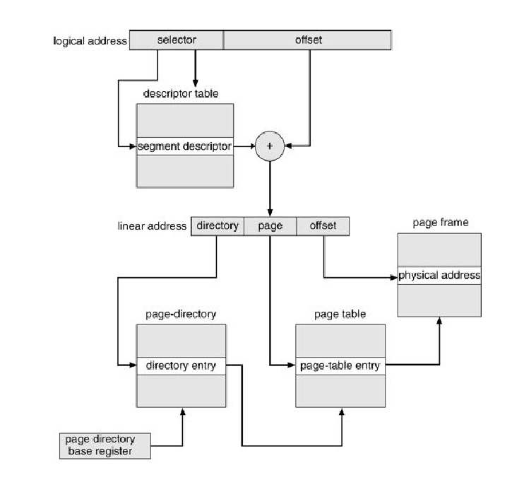

Системні виклики для взаємодії з підсистемою віртуальної пам'яті:

- `brk`, `sbrk` — для збільшення сегменту пам'яті, виділеного для даних програми
- `mmap`, `mremap`, `munmap` — для відображення файлу чи пристрою в пам'ять
- `mprotect` — зміна прав доступу до областей пам'яті процесу

Приклад виділення пам'яті процесу:

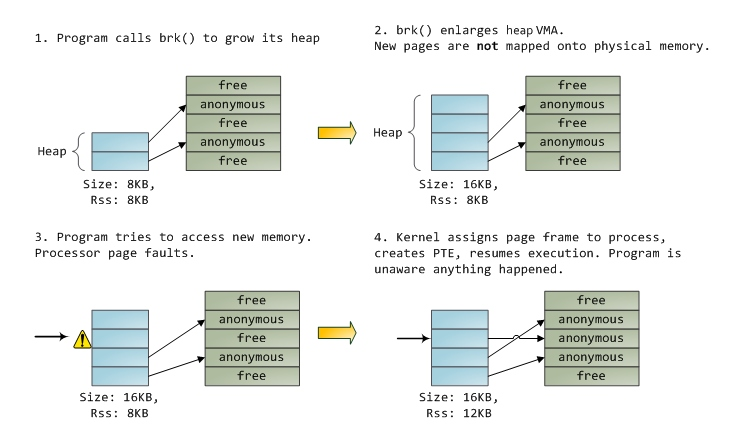

## Алгоритми виділення пам'яті

Ефективне виділення пам'яті потребує швидкого (за 1 або декілька операцій) знаходження вільної ділянки пам'яті потрібного розміру.

Способи обліку вільних ділянок:

- бітова карта (bitmap) — кожному блоку пам'яті (наприклад, сторінці) ставиться у відповідність 1 біт, який має значення зайнятий/вільний
- зв'язний список — кожному безперервному набору блоків пам'яті одного типу (зайнятий/вільний) ставиться у відповідність 1 запис в зв'язковому списку блоків, в якому вказується початок і розмір ділянки
- використання декількох зв'язних списків для ділянок різних розмірів — див. алгоритм [Buddy allocation] (http://en.wikipedia.org/wiki/Buddy_memory_allocation)

## Кешування

Кеш - це компонент комп'ютерної системи, який прозоро зберігає дані так, щоб наступні запити до них могли бути задоволені швидше. Наявність кеша означає також наявність запам'ятовуючого пристрою (набагато) більшого розміру, в якому дані зберігаються первісно. Запити на отримання даних з цього пристрою **прозоро** проходять через кеш в тому сенсі, що якщо цих даних немає в кеші, то вони запитуються з основного пристрою і паралельно записуються в кеш. Відповідно, при подальшому зверненні дані можуть бути прочитані вже з кешу. За рахунок набагато меншого розміру кеш може бути зроблено набагато швидшим і в цьому основна мета його існування.

За принципом запису даних в кеш виділяють:

- наскрізний (write-through) — дані записуються синхронно і в кеш, і безпосередньо в запам'ятовуючий пристрій
- зі зворотним записом (write-back, write-behind) — дані записуються в кещ і іноді синхронізуються з запам'ятовуючим пристроєм

За принципом зберігання даних виділяють:

- повністю асоціативні
- множинно-асоціативні
- прямої відповідності

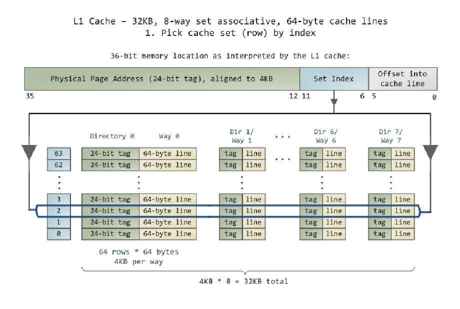

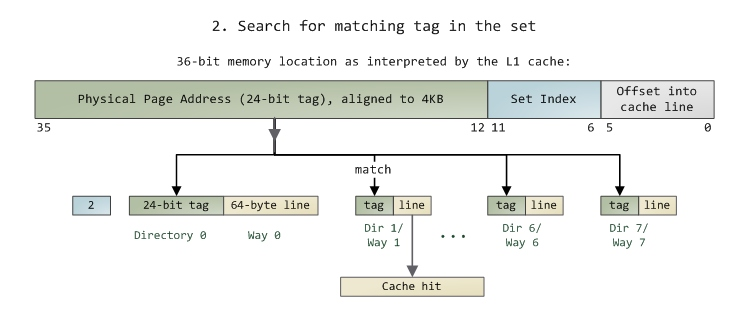

### Алгоритми заміщення записів в кеші

Оскільки будь-якмй кеш завжди менше запам'ятовуючого пристрою, завжди виникає необхідність для запису нових даних в кеш видаляти з нього раніше записані. Ефективне видалення даних з кеша має на увазі видалення найменш затребуваних даних. У загальному випадку не можна сказати, які дані є найменш затребуваними, тому для цього використовуються евристики. Наприклад, можна видаляти дані, до яких відбувалося найменше число звернень з моменту їх завантаження в кеш (least frequently used, **LFU**) або ж дані, до яких зверталися найменш нещодавно (least recently used, **LRU**), або ж комбінація цих двох підходів (**LRFU**).

Крім того, апаратні обмеження щодо реалізації кеша часто вимагають мінімальних витрат на облік службової інформації про комірки, якою є також і інформація про використання даних в них. Найбільш простим способом обліку звернень є встановлення 1 біта: було звернення або не було. У такому випадку для видалення з кеша може використовуватися алгоритм **годинник** (або **другого шансу**), який по колу проходить по всім коміркам, і вивантажує комірку, якщо у неї біт дорівнює 0, а якщо 1 — скидає його в 0.

Більш складним варіантом є використання апаратного лічильника для кожної комірки. Якщо цей лічильник фіксує число звернень до комірки, то це простий варіант алгоритму LFU. Він володіє наступними недоліками:

- може статися переповнення лічильника (а він, як правило, має дуже невелику розрядність) — в результаті буде втрачена вся інформація про звернення до комірки
- дані, до яких робилось багато звернень в минулому, будуть мати високе значення лічильника навіть якщо за останній час до них не було звернень

Для вирішення цих проблем використовується механізм **старіння**, який передбачає періодичний зсув вправо одночасно лічильників для всіх комірок. У цьому випадку їх значення будуть зменшуватися (у 2 рази), зберігаючи пропорцію між собою. Це можна вважати варіантом алгоритму LRFU.

## Література

- [Управление памятью](http://citforum.ru/operating_systems/sos/glava_7.shtml)
- [Виртуальная память](http://gendocs.ru/v31765/?cc=9)
- [What Every Programmer Should Know About Memory](http://people.redhat.com/drepper/cpumemory.pdf)
- [The Memory Management Reference](http://www.memorymanagement.org/)
- [Software Illustrated series by Gustavo Duarte](http://duartes.org/gustavo/blog/category/internals):
	- [How The Kernel Manages Your Memory](http://duartes.org/gustavo/blog/post/how-the-kernel-manages-your-memory)
	- [Memory Translation and Segmentation](http://duartes.org/gustavo/blog/post/memory-translation-and-segmentation)
	- [Getting Physical With Memory](http://duartes.org/gustavo/blog/post/getting-physical-with-memory)
	- [What Your Computer Does While You Wait](http://duartes.org/gustavo/blog/post/what-your-computer-does-while-you-wait)
	- [Cache: a place for concealment and safekeeping](http://duartes.org/gustavo/blog/post/intel-cpu-caches)
    - [Page Cache, the Affair Between Memory and Files](http://duartes.org/gustavo/blog/post/page-cache-the-affair-between-memory-and-files)
- [Real Mode Memory Management](http://www.internals.com/articles/protmode/realmode.htm)
- [Memory Testing from Userspace Programs](http://antirez.com/news/43)
