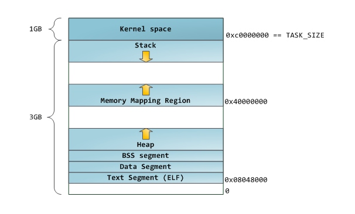
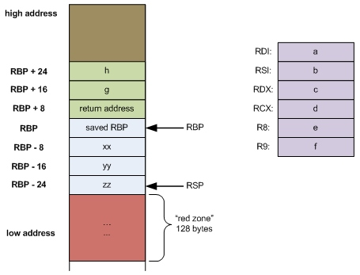
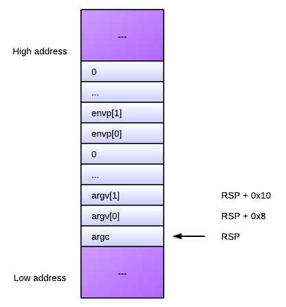
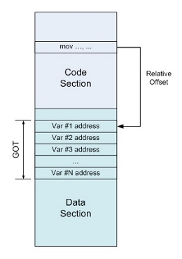

## Програма в пам'яті

Виконання програми починається з системного виклику `exec`, якому передається шлях до файлу з бінарним кодом програми. `exec` — це інтерфейс до завантажувача ОС, який завантажує секції програми в пам'ять в залежності від формату виконуваного файлу, в який скомпільована програма, а також виділяє додаткові секції динамічної пам'яті. Після завантаження пам'ять програми продовжує бути розділеною на окремі секції. Вказівники на початок/кінець і інші властивості кожної секції знаходяться в структурі `mm_struct` поточного процесу.

Для завантаження окремих сегментів в пам'ять використовується системний виклик `mmap`.

### Статична пам'ять програми

Статична пам'ять програми — це частина пам'яті, яка є відображенням коду об'єктного файлу програми. Вона ініціалізується завантажувачем програм ОС з виконуваного файлу (спосіб ініціалізації залежить від конкретного формату виконуваного файлу).

Вона включає декілька секцій, серед яких загальнопоширеними є:

- Секція `text` — секція пам'яті, в яку записуються самі інструкції програми
- Секція `data` — секція пам'яті, в яку записуються значення статичних змінних програми
- Секція `bss` — секція пам'яті, в якій виділяється місце для запису значень оголошених, але не ініціалізований в програмі статичних змінних
- Секція `rodata` — секція пам'яті, в яку записуються значення констант програми
- Секція таблиці символів — секція, в якій записані всі зовнішні (експортовані) символи програми з адресами їх місцезнаходження в секціях `text` або `data` програми

### Динамічна пам'ять програми

Динамічна пам'ять виділяється програмі в момент її створення, але її вміст створюється програмою по мірі її виконання. В області динамічної пам'яті використовується 3 стандартні секції, крім яких можуть бути і інші.

Стандартні секції включають:

- стек (stack)
- купа (heap)
- сегмент відображуваної пам'яті (memory map segment)

Для виділення додаткового обсягу динамічної пам'яті використовується системний виклик `brk`.

### Стек

(Більш правильна назва використовуваної структури даних — **стопка** або **магазин**. Однак, історично прижилося запозичена назва стек).

Стек (stack) — це частина динамічної пам'яті, яка використовується при виклику функцій для зберігання їх аргументів і локальних змінних. В архітектурі x86 стек росте вниз, тобто вершина стека має найменший адресу. Регістр `SP` (Stack Pointer) вказує на поточну вершину стека, а регістр `BP` (Base Pointer) вказує на т.зв. базу, яка використовується для розділення стека на логічні частини, що відносяться до однієї функції — **фрейми** (кадри). Крім операцій звернення до пам'яті безпосередньо, які можуть застосуються в тому числі для роботи зі стеком, додатково для нього також введені інструкції `push` і `pop`, які записують дані на вершину стека і зчитують дані з вершини, після чого видаляють. Ці операції здійснюють зміну регістру `SP`.

Як правило, програми на високорівневих мовах програмування не працюють зі стеком безпосередньо, а це робить за них компілятор, реалізуючи певні угоди про виклики функцій і способи зберігання локальних змінних. Однак стандартна функція `alloca` дозволяє динамічно виділяти пам'ять на стеку.

Виклик функції високорівневого мови створює на стеку новий фрейм, який містить аргументи функції, адресу повернення з функції, покажчик на початок попереднього фрейму, а також місце під локальні змінні.

На початку роботи програми в стеку виділений тільки 1 фрейм для функції `main` і її аргументів — числового значення `argc` і масиву покажчиків змінної довжини `argv`, кожен з яких записується на стек окремо, а також змінних оточення.

### Купа

Купа (heap) — це частина динамічної пам'яті, призначена для виділення ділянок пам'яті довільного розміру. Вона в першу чергу використовується для роботи з масивами невідомої заздалегідь довжини (буферами), структурами і об'єктами.

Для управління купою використовується підсистема виділення пам'яті (memory allocator), інтерфейс до якого — це функції `malloc`/`calloc` в C, а також `free`.

Основні вимоги до аллокатору пам'яті:

- мінімальне використовуваний простір, фрагментація
- мінімальний час роботи
- максимальна **локальність** пам'яті
- максимальна настроюваність
- максимальна сумісність зі стандартами
- максимальна переносимість
- виявлення найбільшого числа помилок
- мінімальні аномалії

Багато мов високого рівня реалізують більш високорівневий механізм управління пам'яттю понад системним аллокатором — автоматичне виділення пам'яті зі збирачем сміття. У цьому випадку у програми немає безпосереднього інтерфейсу до аллокатору і керування пам'яттю здійснює середовище виконання програми.

Варіанти реалізації збирання сміття:

- підрахунок посилань
- трасування/з виставленням прапорів (Mark and Sweep)

### Сегмент файлів, що відображаються в пам'ять

Сегмент файлів, що відображаються в пам'ять — це окрема область динамічної пам'яті, яка використовується для ефективно роботи з файлами, а також для підключення ділянок пам'яті інших програм за допомогою виклику `mmap`.

## Виконувані файли

В результаті компіляції програми на асемблері в машинний код створюється виконуваний файл, тобто файл, що містить безпосередньо інструкції процесора.

Типи виконуваних файлів:

- об'єктний файл (object file) — файл, перетворений компілятором, але не приведений остаточно до виду виконуваного файлу в одному з форматів виконуваних файлів
- виконувана програма (executable) — файл в одному з форматів виконуваних файлів, який може бути запущений завантажувачем програм ОС
- розділяєма бібліотека (shared library) — програма, яка не може бути запущена самостійно, а підключається (компілятором) як частина інших програм
- знімок вмісту пам'яті (core dump) — знімок стану програми в момент її виконання — може дозволити продовжити виконання програми з того місця, на якому він був зроблений

### Формати виконуваних файлів

Формат виконуваного файлу — це визначена структура бінарного файлу, створюваного компілятором і збирачем програми і споживана завантажувачем програм ОС.

В рамках формату виконуваних файлів описується:

- спосіб задання секцій файлу, їх кількість і порядок
- метадані, їх типи та розміщення у файлі
- яким чином файл буде завантажуватися: за якою адресою в пам'яті, в якій послідовності
- спосіб опису імпортованих і експортованих символів
- обмеження на розмір файлу і т.п.

Поширені формати:

- .COM
- A.out
- COFF
- DOS MZ Executable
- Windows PE
- Windows NE
- ELF

Формат ELF (Executable and Linkable Format) — стандартний формат виконуваних файлів в Linux. Файл в цьому форматі містить:

- заголовок файлу
- таблицю заголовків сегментів програми
- таблицю заголовків секцій програми
- блоки даних

Сегменти програми містять інформацію, використовувану завантажувачем програми, а секції — використовувану компонувальником. Ця інформація включає ввідні дані для релокації.

Окреме питання — це запис відлагоджувальної інформації в виконуваний файл. Це може бути специфікованим як самим форматом, так і додатковими форматами, такими як:

- stabs
- DWARF

## Бібліотеки

Бібліотеки містять функції, які виконують типові дії, які можуть використовуватися іншими програмами. На відміну від виконуваної програми бібліотека не має точки входу (функції `main`) і призначена для підключення до інших програм або бібліотек. Стандартна бібліотека C (`libc`) — перша і основна бібліотека будь-якої програми на C.

Бібліотеки можуть підключатися до програми в момент:

- збирання — build time (такі бібліотеки називаються статичними)
- завантаження — load time
- виконання — run time

Розділювані бібліотеки — це бібліотеки, які підключаються в момент завантаження або виконання програми і можуть розділятися між декількома програмами в пам'яті для економії пам'яті. Крім того вони не включаються в код програми і таким чином не збільшують його обсяг. З іншого боку, вони в більшій мірі страждають від проблеми конфлікту версій залежностей різних компонент (у застосуванні до бібліотек вона має назву DLL hell).

Способи підключення розділюваних бібліотек в Unix:

- релокації часу завантаження програми
- позиційно-незалежний код (PIC)

Релокації часу завантаження програми використовують спеціальну секцію виконуваного файлу — таблицю релокації, в якій записуються перетворення, які потрібно провести з кодом бібліотеки при її завантаженні. Недоліки цього способу — збільшення часу завантаження програми через необхідність переписування коду бібліотеки для застосування всіх релокацій на цьому етапі, а також неможливість зробити секцію коду бібліотеки розділеною в пам'яті через те, що релокації для кожної програми застосовуватися по-різному, адже бібліотека завантажується в пам'ять за різними віртуальним адресами.

Позиційно-незалежний код використовує таблицю глобальних відступів (Global Offset Table, GOT), в якій записуються адреси всіх експортованих символів бібліотеки. Його недолік — це уповільнення усіх звернень до символів бібліотеки через необхідність виконувати додаткове звернення до GOT.

Для підтримки пізнього зв'язування функцій через механізм "трампліну" також застосовується таблиця компонування процедур (Procedure Linkage Table, PLT).

## Віртуальні машини

Віртуальна машина — це програмна реалізація реального комп'ютера, яка виконує програми.

Застосування віртуальних машин:

- збільшення переносимості коду
- дослідження та оптимізація програм
- емуляція
- пісочниця
- віртуалізація
- платформа для R&D мов програміірованія
- платформа для R&D різних комп'ютерних систем
- приховування програм (віруси)

Типи:

- системна — повна емуляція комп'ютера
- процесна — часткова емуляція комп'ютера для одного з процесів ОС

### Системні ВМ

Види системних ВМ :

- гіпервізор/монітор віртуальних машин: тип 1 (на голому залізі) і тип 2 (на ОС-хазяїні)
- паравіртуалізації

Вимоги Попека і Голдберга для ефективної віртуалізації:

- усі чутливі інструкції апаратної архітектури є привілейованими
- не має тимчасових обмежень на виконання інструкцій (рекурсивна віртуалізація)

Приклади: VMWare, VirtualBox, Xen, KVM, Quemu, Linux LXC containers, Solaris zones

:br

### Процесні ВМ

Процесні ВМ функціонують за принципом 1 процес — 1 примірник ВМ і, як правило, надають інтерфейс більш високого рівня, ніж апаратна платформа.

Код програми для таких ВМ компілюється в проміжне представлення (**байт-код**), який потім інтерпретується ВМ. Часто в них також використовується JIT-компіляція байт-коду в рідній код.

Варіанти реалізації:

- Стек-машина (0 - операнд)
- Акумуляторна машина (1- операнд)
- Регістрова машина (2- або 3-операнд)

Приклади: JVM, .Net CLR, Parrot, LLVM, Smalltalk VM, V8

## Література

- [Anatomy of a Program in Memory](http://duartes.org/gustavo/blog/post/anatomy-of-a-program-in-memory)
- [How is a binary executable organized](http://jvns.ca/blog/2014/09/06/how-to-read-an-executable/)
- [Inside Memory Management](http://www.ibm.com/developerworks/linux/library/l-memory/)
- [x86 Registers](http://www.eecg.toronto.edu/~amza/www.mindsec.com/files/x86regs.html)
- [Stack frame layout on x86-64](http://eli.thegreenplace.net/2011/09/06/stack-frame-layout-on-x86-64/)
- [Doug Lea's malloc](http://g.oswego.edu/dl/html/malloc.html)
- [Visualizing Garbage Collection Algorithms](http://spin.atomicobject.com/2014/09/03/visualizing-garbage-collection-algorithms/)
- [Demystifying Garbage Collectors](http://xtzgzorex.wordpress.com/2012/10/11/demystifying-garbage-collectors/)
- Eli Bendrski on Static and Dynamic Object Code in Linux:
	- [How Statically Linked Programs Run on Linux](http://eli.thegreenplace.net/2012/08/13/how-statically-linked-programs-run-on-linux/)
	- [Load-time relocation of shared libraries](http://eli.thegreenplace.net/2011/08/25/load-time-relocation-of-shared-libraries/)
	- [Position Independent Code (PIC) in shared libraries](http://eli.thegreenplace.net/2011/11/03/position-independent-code-pic-in-shared-libraries/)
	- [Position Independent Code (PIC) in shared libraries on x64](http://eli.thegreenplace.net/2011/11/11/position-independent-code-pic-in-shared-libraries-on-x64/)
- [How To Write Shared Libraries](http://software.intel.com/sites/default/files/m/a/1/e/dsohowto.pdf)
- [Executable and Linkable Format (ELF)](http://www.bottomupcs.com/elf.html)
- [Why do Windows functions all begin with a pointless MOV EDI, EDI instruction?](http://blogs.msdn.com/b/oldnewthing/archive/2011/09/21/10214405.aspx)
