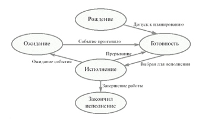
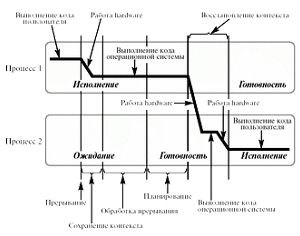
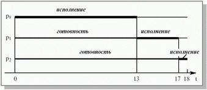
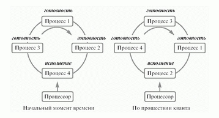
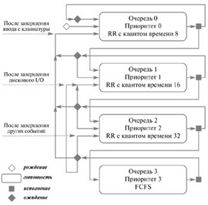

## Процесс

Процесс – это адресное пространство и единая нить управления. (Устаревшее определение)

Более точно понятие процесса включает в себя:

- Программу, которая исполняется
- Ее динамическое состояние (регистровый контекст, состояние памяти и т.д.)
- Доступные ресурсы (как индивидуальные для процесса, такие как дескрипторы файлов, так и разделяемые с другими)

В ОС структура Процесс (Process control block) — одна из ключевых структур данных. Она содержит всю информации о процессе, необходимую разным подсистемам ОС. Эта информация включает:

- PID (ID процесса)
- PPID (ID процесса-родителя)
- путь и аргументы, с которым запущен процесс
- программный счетчик
- указатель на стек
- и др.

Ниже приведена небольшая часть этой структуры в ОС Linux:

	#include<sched.h>
	struct task_struct {
            /* Состояние:
             * -1 - заблокированный,
             *  0 - готовность,
             * >0 - остановленный */
	        volatile long state;
	        void *stack;
	        unsigned long flags;
	        int prio, static_prio, normal_prio;
	        struct list_head run_list;
	        const struct sched_class *sched_class;
	        ...
	/* task state */
	        struct linux_binfmt *binfmt;
	        long exit_state;
	        int exit_code, exit_signal;
	        int pdeath_signal;
	        pid_t pid;
	        pid_t tgid;
	        struct task_struct *real_parent;
	        struct task_struct *parent;
	        struct list_head children;
	        struct list_head sibling;
	        struct task_struct *group_leader;
	        struct timespec start_time;
	        struct timespec real_start_time;
	        ...
	/* process credentials */
	        uid_t uid,euid,suid,fsuid;
	        gid_t gid,egid,sgid,fsgid;
	        struct group_info *group_info;
	        kernel_cap_t cap_effective,
                cap_inheritable, cap_permitted;
	        unsigned keep_capabilities:1;
	        struct user_struct *user;
	        ...
	/* open file information */
	        struct files_struct *files;
	/* namespace */
	        struct nsproxy *nsproxy;
	/* signal handlers */
	        struct signal_struct *signal;
	        struct sighand_struct *sighand;
	        ...
	};

### Нить управления

Нить управления (thread) — это одна логическая цепочка выполнения команд. В одном процессе может быть как одна нить управления, так и несколько (в системах с поддержкой многопоточности — multithreading).

ОС предоставляет интерфейс для создания нитей управления и в этом случае берет на себя их планирование на равне с планированием процессов. В стандарте POSIX описан подобный интерфейс, который реализован в библиотеке **PTHREADS**. Нити, предоставляемые ОС, называются **родными** (native). Однако любой процесс может организовать управление нитями внутри себя независимо от ОС (фактически, в рамках одной родной нити ОС). Такой подход называют **зелеными** или **легковесными** нитями.

Волокно (fiber) — легковесная нить, которая работает в системе кооперативной многозадачности (см. ниже).

Преимущества родных нитей:

- не требуют дополнительных усилий по реализации
- используют стандартные механизмы планирования ОС
- блокировка и реакция на сигналы ОС происходит в рамках нити, а не всего процесса

Преимущества зеленых нитей:

- потенциально меньшие накладные расходы на создание и поддержку
- не требуют переключения контекста при системных вызовах, что дает потенциально большое быстродействие
- гибкость: процесс может реализовать любую стратегию планирования таких нитей

### Виды процессов

Процессы могут запускаться для разных целей:

- выполнения каких-то одноразовых действий (например, скрипты)
- выполнения задач под управлением пользователя (интерактивные процессы, такие как редактор)
- беспрерывной работы в фоновом режиме (сервисы или демоны, такие как сервис терминала или почтовый сервер)

Процесс-демон — это процесс, который запускается для долгосрочной работы в фоновом режиме, отключается от запустившего его терминала (его стандартные потоки ввода-вывода закрываются либо перенаправляются в лог-файл) и меняет свои полномочия на минимально необходимые. Управление таким процессом, обычно, осуществляется с помощью механизма сигналов ОС.

:br

## Жизненный цикл процесса

### Порождение процесса

Все процессы ОС, за исключением первого процесса, который запускается после загрузки ядра, имеют родителя. Создание нового процесса требует инициализации структуры PCB и запуска (постановки на планирование) нити управления процесса. Основным требованием к этим операциям является скорость выполнения. Инициализация структуры PCB с нуля является затратной операцией, кроме того порожденному процессу, как правило, требуется доступ к некоторым ресурсам (таким как потоки ввода-вывода) родительского процесса. Поэтому обычно структура нового процесса создается методом **клонирования** структуры родителя. Альтернативой является загрузка предварительно инициализированной структуры из файла и ее модификация.

Модель **fork/exec** — это модель двухступенчатого порождения процесса в Unix-системах. На первой ступени с помощью системного вызова `fork` создается идентичная копия текущего процесса (для обеспечения быстродействия, как правило, через механизм копирования-при-записи - copy-on-write, COW). На втором этапе с помощью операции `exec` в память созданного процесса загружается новая программа. В этой модели процесс-родитель имеет возможность дождаться завершения дочернего процесса с помощью системных вызовов семейства `wait`. Разбивка этой операции на два этапа дает возможность легко порождать идентичные копии процесса (например, для масштабирования приложения - такой способ применяется в сетевых серверах), а также гибко управлять ресурсами, доступными дочернему процессу.

### Завершение процесса

По завершению процесс возвращает целочисленный код возврата (exit code) — результат выполнения функции `main`. В Unix-системах код возврата, равный 0, сигнализирует об успехе, все остальные говорят об ошибке (разработчик приложения волен произвольно сопоставлять ошибки возвращаемым значениям).

Процесс может завершиться следующим образом:

- нормально: вызвав системный вызов `exit` или выполнив `return` из функции `main` (что приводит к вызову `exit` в функции `libc`, которая запустила `main`)
- ошибочно: если выполнение процесса вызывает критическую ошибку (`Segmentation Fault`, `General Protection Exception`, `Divizion by zero` или другие аппартаные исключения)
- принудительно: если процесс завершается ОС, например, при нехватки памяти, а также, если он не обрабатывает какой-либо из посланных ему сигналов (в том числе, сигнал `KILL`, который невозможно обработать, из-за чего посылка этого сигнала всегда приводит к завершению процесса)

Используя функции семейства `wait`, один процесс может ожидать завершения другого. Это часто используется в родительских процессах, которым нужно получить информацию о завершении своих потомков, чтобы продолжить работу. Вызовы `wait` являются блокирующими — функция не завершится, пока не завершится процесс, которого она ждёт.

Если потомок завершается, но родительский процесс не вызывает `wait`, потомок становится т.н. процессом **зомби**. Это завершившиеся процессы, информация о завершении которых никем не запрошена. Впрочем, после завершения родительского процесса все его потомки переходят к процессу с PID 1, т.е. `init`. Он самостоятельно очищает информацию, оставшуюся после зомби.

Пример программы, порождающей новый процесс и ожидающей его завершения:

	#include <sys/types.h>
	#include <unistd.h>
	#include <stdio.h>
	#include <stdlib.h>

	int main() {
	    // Клонируем текущий процесс
	    pid_t childpid = fork();

	    /* Переменная childpid будет существовать
         * и в оригинальном процессе, и в его клоне,
         * но в дочернем процессе она будет равна 0 */
	    if (!childpid) {
			// это дочерний процесс
	        char* command[3] = {"/bin/echo", "Hello, world!", NULL};

	        execvp(command[0], command);

	        /* Если не произошло никаких ошибок, execvp() не завершается
             * и программа никогда не достигнет этого участка кода */
	        exit(EXIT_FAILURE);
	    } else if (childpid == -1) {
	        // fork() возвращает -1 в случае ошибки
	        fprintf(stderr, "Can't fork, exiting...\n");
	        exit(EXIT_FAILURE);
	    } else {
	        // Это родительский процесс
	        exit(EXIT_SUCCESS);
	    }

	    return 0;
	}

### Работа процесса

В мультипроцессных системах все процессы исполняются на процессоре не все время своей работы, а только его часть. Соответственно, можно выделить:

- общее время нахождения процесса в системе: от момента его запуска до завершения
- (чистое) время исполнения процесса
- время ожидания

В состояние ожидания процесс может перейти либо при поступлении прерывания от процессора, либо после вызова самим процессом блокирующей операции, либо после добровольной передачи процессом управления ОС (вызов планировщика `schedule` при вытесняющей многозадачности либо же операция `yield` при кооперативной многозадачности).

При переходе процесса в состояние ожидания происходит **переключение контекста** и запуск на процессоре кода ядра ОС (кода обработки прерываний или кода планировщика). Переключение контекста подразумевает сохранение в памяти содержания связанных с исполняемым процессом регистров и загрузка в регистры значений для следующего процесса.

В системах с вытесняющей многозадачностью прерывание `CLOCK INTERRUPT` вызывает планировщик ОС, который переводит процесс в состояние ожидания, если отведенное ему на исполнение время истекло.

Завершение блокирующих операций знаменуется прерыванием, при обработке которого ОС переводит заблокированный процесс в состояние готовности к работе.

## Планирование процессов

Многозадачность — это свойство операционной системы или среды программирования обеспечивать возможность параллельной (или псевдопараллельной) обработки нескольких процессов.

Виды многозадачности:

- вытесняющая
- невытесняющая
- кооперативная (подвид невытесняющей)

Вытесняющая многозадачность подразумевает наличие в ОС специальной программы-планировщика процессов, который принимает решение о том, какой процесс должен выполняться и сколько времени отвести ему на выполнение. После завершения отведенного времени процесс принудительно прерывается и управление передается другому процессу.

При невытесняющей многозадачности процессы работают поочередно, причем переключение происходит по завершению всего процесса или логического блока в его рамках. Кооперативная многозадачность — это вариант невытесняющей многозадачности, в которой только сам процесс может сигнализировать ОС о готовности передать управление.

### Алгоритмы планирования процессов

Планирование процессов применяется в системах с вытесняющей многозадачностью.

Требования к алгоритмам планирования:

- справедливость
- эффективность (в смысле утилизации ресурсов)
- стабильность
- масштабируемость
- минимизация времени: выполнения, ожидания, отклика

Алгоритмы планирования для выбора следующего процесса на исполнение, как правило, используют **приоритет** процесса. Приоритет может определяться статически (один раз для процесса) или же динамически (пересчитываться на каждом шаге планирования).

### Алгоритм Первый пришел — первый обслужен (FCFS)

Это простой алгоритм с наименьшими накладными расходами. Это алгоритм со статическим приоритетом, в качестве которого выступает время прихода процесса. Это наименее стабильный алгоритм, который не может гарантировать приемлемое время отклика в интерактивных системах, поэтому он применяется только в системах batch-обработки.

### Алгоритм Карусель (Round Robin)

Этот алгоритм предполагает попеременное выполнение всех процессов в течение одинакового кванта времени, после завершения которого независимо от состояния процесса он прерывается и управление переходит к следующему процессу. Этот алгоритм является наиболее стабильным и простым. Он вообще не использует приоритет процесса.

### Алгоритм справедливого планирования

В основе этого алгоритма лежит принцип: из всех кандидатов на выполнение должен выбираться тот, у которого отношение чистого времени фактической работы к общему времени нахождения в системе наименьший. Иными словами, этот алгоритм использует динамический приоритет, который вычисляется по формуле `p = t / T` (где `t` - чистое время исполнения, `T` - время прошедшее от запуска процесса; чем меньше значение `p`, тем приоритет выше).

:br

### Алгоритм Многоуровневая очередь с обратной связью

В качестве примера более сложного адаптивного алгоритма могут служить многоуровневые очереди с обратной связью, которые принимают решение о приоритете процесса на основе времени, которое необходимо ему для завершения работы или текущего логического блока.

### Реальные алгоритмы

Алгоритмы, применяемые в реальных системах, делятся на алгоритмы для интерактивных систем и алгоритмы для систем реального времени. Алгоритмы для систем реального времени всегда имеют ограничения на время завершения отдельных операций, поэтому им для планирования необходима дополнительная информация, которой, как правило, нет в интерактивных системах — например, время до завершения процесса.

В основе реальных алгоритмов лежат базовые алгоритмы, перечисленные выше, но также они используют некоторые дополнительные парамаетры такие как:

- эпохи (временные интервалы, в конце которых накопленная для планирования информация сбрасывается)
- группировку процессов по классам (мягкого реального времени, процессы ядра, интерактивные, фоновые и т.д.) для обеспечения лучшего времени отклика системы

Кроме того, в таких системах учитываются технологии Симметричный мультипроцессинг (Symmetrical Multiprocessing, SMP) и Одновременная многопоточность (Symulteneous Multithreading, SMT), при которых несколько ядер процессора или несколько логических потоков исполнения в процессоре работают с общей памятью.

## Межпроцессное взаимодействие (IPC)

### Цели взаимодействия:

- модульность (путь Unix: маленькие кусочки, слабо связанные между собой, которые делают что-то одно и делают это очень хорошо)
- масштабирование
- совместное использование данных
- разделение привилегий
- удобство

### Типы взаимодействия:

- через разделяемую память
- обмен сообщениями
	- сигнальный
	- канальный
    - широковещательный

### Взаимодействие через разделяемую память

Самый быстрый и простой способ взаимодействия, при котором процессы записывают и считывают данные из общей области памяти. Он не требует никаких накладных расходов, но подразумевает наличие договоренности о формате записываемых данных. Проблемы этого подхода:

- необходимость блокирующей синхронизации для обеспечения неконфликтного доступа к общей памяти
- увеличение логической связности между отдельными процессами
- не возможность масштабироваться за рамками памяти одного компьютера

### Обмен сообщениями

Передача сообщений обладает прямо противоположными свойствами и считается более предпочтительным способом организации взаимодействия в общем случае. Сообщения могут передаваться как индивидуально, так и в рамках выделенной сессии обмена сообщениями.

### Сигнальный способ взаимодействия

Сигнальный способ — это вариант взаимодействия через передачу сообщений, который предполагает возможность отправки только заранее предопределенных сигналов, которые не имеют никакой нагрузки в виде данных. Таким образом сигналы могут передавать информацию только о предварительно заданном наборе событий. Такая система является простой, но не способна обслуживать все варианты взаимодействия. Поэтому она часто применяется для обслуживания критических сценариев работы.

Системный вызов `kill` позволяет посылать сигналы процессам Unix. Среди них есть зарезервированные сигналы, такие как:

- `TERM` - запрос на завершение процесса
- `HUP` - запрос на перезапуск процесса
- `ABRT` - запрос на отмену текущей операции (генерируется ОС при нажатии `Ctrl-C`)
- `PIPE` - сигнал о закрытии конвеера другим процессом
- `KILL` - сигнал о принудительном завершении процесса
- и др.

Процес в Unix обязан обработать пришедший ему сигнал, иначе ОС принудительно завершает его работу.

:br

### Канальный способ взаимодействия

Канальный способ — это вариант взаимодействия через передачу сообщений, при котором между процессами устанавливается канал соединения, в рамках которого передаются сообщения. Этот канал может быть как односторонним (сообщения идут только от одного процесса к другому), так и двусторонним.

Pipe (конвеер, анонимный канал) — односторонний канал, который позволяет процессам передавать данные в виде потока байт. Это самый простой способ взаимодействия в Unix, имеющий специальный синтаксис в командных оболочках (`proc1 | proc2`, что означает, что данные из процесса `proc1` передаются в `proc2`). Анонимный канал создается системным вызовом `pipe`, который принимает на вход массив из двух чисел и записывает в них два дескриптора (один из них открыт на запись, а другой — на чтение).

Особенности анонимных каналов:

- данные передаются построчно
- не задан формат сообщений, т.е. процессы сами должны "договариваться" о нем
- ошибка в канале приводит к посылке сигнала `PIPE` к процессу, который пытался выполнить чтение или запись в него

Именованный канал (named pipe) создается с помощью системного вызова `mkfifo`. Фактически, он является правильным заменителем для обмена данными через временные файлы, поскольку тот обладает следующими недостатками:

- использование медленного диска вместо более быстрой памяти
- расход места на диске (в то время как при обмене данными через FIFO после считывания они стираются); более того, место на диске может закончиться
- у процесса может не быть прав создать файл или же файл может быть испорчен/удален другим процессом

### Модель Акторов

Модель акторов Хьювита — это теоретическая модель, ислледующая взаимодействие независимых програмных агентов.

Актор — это независимый легковесный процесс, который взаимодействует с другими процессами только через передачу сообщений. В этой модели процессы не используют разделяемую память.

Эта модель лежит в основе языка программирования Erlang, а также библиотека для организации распределенной работы Java-приложений Akka.

## Литература

- [POSIX: командная оболочка и системные вызовы](http://ro-che.info/docs/2010-10-22-posix.pdf)
- [Advanced Linux Programming: Processes](http://www.makelinux.net/alp/)
- [Daemons, Signals, and Killing Processes](http://docs.freebsd.org/doc/7.4-RELEASE/usr/share/doc/en/books/handbook/basics-daemons.html)
- [Taxonomy of UNIX IPC Methods](http://catb.org/~esr/writings/taoup/html/ch07s02.html)
- [Understanding the Linux Kernel - 10. Process Scheduling](http://home.mit.bme.hu/~meszaros/edu/oprendszerek/segedlet/unix/2_folyamatok_es_utemezes/linux_utemezes.pdf)
- [The Linux Process Scheduler](http://www.informit.com/articles/article.aspx?p=101760&seqNum=2)
- [Linux Kernel 2.4 Internals - 2. Process and Interrupt Management](http://tldp.org/LDP/lki/lki-2.html)
- [ULE: A Modern Scheduler For FreeBSD](http://www.scribd.com/doc/3299978/ULE-Thread-Scheduler-for-FreeBSD)
- [How Linux 3.6 nearly broke PostgreSQL](http://lwn.net/Articles/518329/)
- [How Erlang does scheduling](http://jlouisramblings.blogspot.dk/2013/01/how-erlang-does-scheduling.html)
- [Daemons, Signals, and Killing Processes](http://www.freebsd.org/doc/handbook/basics-daemons.html)
