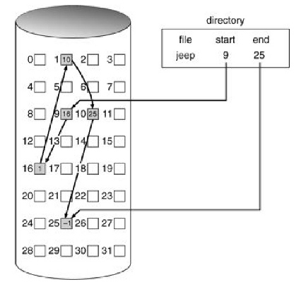
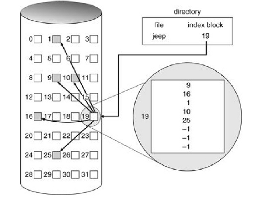
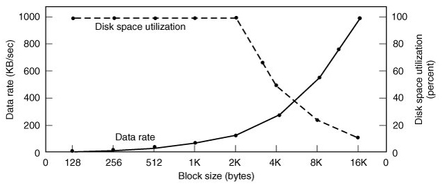
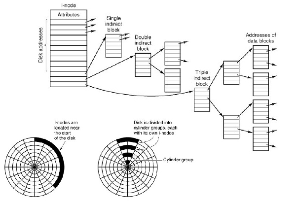

## Файлова система

Файлова система (ФС) — це компонент ОС, що відповідає за постійне зберігання даних.

Задачі:

- зберігання даних в потенційно необмежених об'ємах
- довгострокове зберігання даних (persistence)
- одночасна доступність даних багатьом процесам

На відміну від оперативної пам'яті ФС є постійною пам'яттю, тому на перше місце для них виходять збереження і доступність даних, а потім вже стоїть швидкодія.

Деякі з видів файлових систем:

- Дискові
- Віртуальні (у пам'яті і не тільки)
- Мережеві
- Розподілені
- Мета ФС (ФС, які використовують інші ФС для організації зберігання даних, а самі додають особливу логіку роботи )

[Список ФС](http://en.wikipedia.org/wiki/List_of_file_systems)

Файловий інтерфейс — це простий і зручний спосіб роботи з даними, тому багато ОС поширюють його на інші об'єкти, крім файлів даних. Наприклад, в Unix всі пристрої підключаються в системі як спеціальні файли (символьно-специфічні — для пристроїв з послідовним введенням-виводом; і блочно-специфічні — для пристроїв з буферизованим введенням-виводом). Крім того, в Linux є спеціальні віртуальні файлові системи: `sysfs`, які оперує файлами, що відображають системні структури даних з пам'яті ядра, а також `tmpfs`, яка дозволяє створювати файли в оперативній пам'яті. Такий підхід призвів до того , що Unix став відомий як **файл-центрична** ОС, хоча є інші ОС, які ще далі просунулися в цьому. Наприклад, такі об'єкти, як сокети (див. лекцію про роботу з мережею) в Unix мають власні системні виклики, в той час як в системі Plan 9 (яка стала розвитком ідей Unix) вони доступні через той же файловий інтерфейс.

## Файл

Файл — це іменована область диска. (Невірне і застаріле визначення).
Правильне визначення: файл — це об'єкт файлової системи, що містить інформацію про розміщення даних в сховищі. При цьому сховищі може бути як фізичним запам'ятовуючим пристроєм (диском, магнітною стрічкою і т.д.), так і віртуальним пристроєм, за яким стоїть оперативна пам'ять, пристрій введення-виведення, мережеве з'єднання або ж інша файлова система.

Основні операції над файлами:

- `create` — створення
- `delete` — видалення
- `open` — відкриття (на запис, читання або ж на те й інше разом)
- `close` — закриття
- `read` — читання
- `write` — запис
- `append` — запис в кінець
- `seek` — перехід на задану позицію для подальшого читання/запису
- `getattr` — отримання аттрибутів файлу
- `setattr` — встановлення аттрибутів файлу
- `lock` —  блокування файлу для ексклюзивної роботи з ним (у більшості ОС блокування файлів реалізується у вигляді рекомендаційних, а не обов'язкових замків)

[Файловый дескриптор](http://en.wikipedia.org/wiki/File_descriptor) — це унікальний для процесу номер в таблиці дескрипторів процесу (яка зберігається в ядрі ОС) , який операційна система надає йому, щоб виконувати зазначені операції з файлом. Системи Windows оперують схожою концепцією — описувач файлу (file handle) .

Крім зазначених вище операцій в Unix використовуються наступні важливі системні виклики для роботи з файловими дескрипторами:

- `dup` — створення копії запису в таблиці дескрипторів з новим індексом, що вказує на той же файл
- `dup2` — "перенаправлення" одного запису на інший
- `fcntl` — управління нестандартними атрибутами та властивостями файлів, які можуть підтримуватися тими чи іншими файловими системами

## Директорія

Директорія — це об'єкт файлової системи, що містить інформацію про структуру та розміщенні файлів. Часто це теж файл, тільки особливий.

У більшості ФС директорії об'єднуються в дерево директорій, таким чином створюючи **ієрархічну** систему зберігання інформації. Це дерево має корінь, який в Unix системах називається `/`. Положення файлу в цьому дереві — це **шлях** до нього від кореня — т.зв. **абсолютний шлях**. Крім того, можна говорити про **відносний шлях** від обраної директорії до іншого об'єкта ФС. Відносний шлях може містити особливу позначення `..`, яке вказує на предка (батька) директорії в дереві директорій.

Логічне дерево директорій може об'єднувати більше однієї ФС. Включення ФС в це дерево називається **монтуванням**. В результаті монтування корінь ФС прив'язується до якоїсь директорії всередині дерева. Для першої монтованої системи її корінь прив'язується до кореня самого дерева.

У Unix також реалізована операція `chroot`, яка дозволяє змінити корінь поточного дерева на одну з директорій всередині нього. У рамках одного сеансу роботи, виконавши її, вже не можна повернутися назад, тобто отримати доступ до всіх вузлів дерева, які не є нащадками нового кореня ФС.

Існує два підходи до прив'язки файлів до директорій: у більшості ФС ця прив'язка є непрямою — через використання **посилання** на окремий об'єкт, що зберігає метадані файлу. Такі посилання називаються **жорсткими** (hard link). У таких системах один файл може мати кілька посилань на себе з різних директорій. У такій системі створення нового файлу відбувається в 2 етапи: спочатку виконується операція `create` , яка створює сам файловий об'єкт, а потім `link`, яка прив'язує його до конкретної директорії. Операція `link` може виконуватися кілька разів, і кожен файл зберігає кількість посилань на себе з різних директорій. Видалення файлу відбувається з точністю до навпаки: виконується операція `unlink`, після чого файл перестає бути прив'язаним до директорії. Якщо при цьому його лічильник посилань стає рівним 0, то система виконує над файловим об'єктом операцію `delete`. Однак є і більш примітивні системи, в яких метадані про файлі зберігаються прямо в директорії. Фактично, в таких ФС реалізована однозначна прив'язка файлу до єдиної директорії.

В обох видах систем часто підтримується також концепція **символічних посилань** (реалізованих у вигляді спеціальних файлів), які посилаються НЕ безпосередньо на файловий об'єкт ФС, а на об'єкти, що знаходиться по певному шляху. У цьому випадку ФС вже не може забезпечити перевірку існування такого об'єкта і керування іншими його властивостями, як це робиться для жорстких посилань, але ,з іншого боку, символічні посилання дозволяють посилатися на файли в одному логічному дереві директорій, але за межами поточної ФС.

Операції над директоріями:

- `create` — створити
- `delete` — видалити
- `readdir` (`list`) — отримати список безпосередніх нащадків даної директорії (файлів і інших директорій)
- `opendir` — відкрити директорію для змін информації в ній
- `closedir` — закрити директорію
- `link`/`unlink`

## Схеми розміщення файлів

Схема розміщення файлів — це загальний підхід до зберігання даних і метаданих файлу на пристрої зберігання даних. Основні критерії ефективності тієї чи іншої схеми — це утилізація диска, швидкодія операцій читання, запису і пошуку, а також стійкість до збоїв .

**Фрагментація** — це відсутність технічної можливості використовувати частину простору сховища даних через те чи інше розміщення даних в ньому. Види фрагментації:

- Зовнішня — неможливість використання цілих блоків
- Внутрішня — неможливість використання частин окремих блоків

Внутрішня фрагментація неминуча в будь-якому сховищі, яке оперує блоками більшого розміру, ніж одиниця зберігання (наприклад, жорсткий диск зберігає дані побайтно, але файли можуть починатися тільки з початку логічного блоку, який як правило, має розміри близько кілобайт). Можливість появи зовнішньої фрагментація залежить від схеми розміщення даних.

### Неперервна/послідовна схема

У цій схемі файл зберігається як одна неперервна послідовність блоків. Для вказання розміщення файлу досить задати адресу його початкового блоку і загальний розмір.

Переваги:

- легко реалізувати
- найкраща продуктивність

Недоліки:

- зовнішня фрагментація
- необхідність реалізувати облік дірок
- проблеми з ростом розміру файлу

Це найпростіша схема розміщення. Вона ідеально підходить для будь-яких носіїв, які розраховані на використання тільки в режимі для читання, або ж істотне (на порядки) перевищення числа операцій читання над записом.

### Схема розміщення зв'язковим списком

У цій схемі блоки файлу можуть знаходиться в будь-якому місці диска і не бути впорядкованими якимось чином, але кожен блок повинен зберігати посилання на подальший за ним. Для вказання розміщення файлу досить задати адресу його першого блоку.

Переваги:

- немає зовнішньої фрагментації
- простота реалізації

Недоліки:

- найгірша продуктивність (особливо на магнітних дисках)
- погана стійкість до помилок: пошкодження одного блоку в середині файлу призведе до того, що всі наступні за ним блоки будуть недоступні
- не кругла цифра (в ступенях 2) доступного місця в блоці через використання частини простору блоку для зберігання вказы°ника на наступний блок 

Тому в чистому вигляді така схема рідко застосовується. Перераховані недоліки в основному усуває **таблична** реалізація цієї схеми. У ній інформація про наступні блокі зв'язного списку виноситься з самих блоків в окрему таблицю, яка розміщується в заздалегідь заданому місці диска. Кожен запис у таблиці зберігає номер наступного блоку для даного файлу (або ж індикатор того, що даний блок не зайнятий або ж зіпсований). Така технологія називається **Таблицею розміщення файлів** (див. [FAT]( http://averstak.tripod.com/fatdox/fatintro.htm)). Недоліком табличній схеми є централізація всіх метаданих в таблиці, що призводить до небезпеки втрати всієї ФС у разі непоправного пошкодження таблиці, а також до того, що для великих дисків ця таблиця буде мати великий об'єм, а вона повинна весь час бути повністю доступною в пам'яті.

### Індексна схема

У цій схемі блоки поділяють на 2 типи: ті, які використовуються для зберігання даних файлу, і ті, які зберігають метадані — т.зв. індексні вузли (**inode**). Таким чином, на відміну від попередньої схеми, метадані про файли зберігаються розподілено в ФС, що робить цей підхід більш ефективним і відмовостійким. Крім того, ця схема відповідає власне ієрархічної моделі ФС і тривіально підтримує операції link/unlink: директорія зберігає посилання на індексні вузли прив'язаних до неї файлів. Оскільки індексні вузли — це звичайні блоки диска, до них застосовуються ті ж методи роботи, що і для звичайних блоків (наприклад , кешування).

Переваги:

- концептуальне відповідність між логічної і фізичної схемою зберігання
- велика ефективність і швидкодія
- велика відмовостійкість

Недоліки:

- фіксований розмір індексного вузла, що накладає обмеження на розмір файлу (для вирішення цієї проблеми використовуються непрямі inod'и, які зберігають посилання не на блоки даних, а на inod'и наступного рівня)

## Оптимізація роботи ФС

Важливим параметром, що впливає на оптимізацію ФС є середній розмір файлу. Він сильно залежить від сценаріїв використання системи, але проводяться дослідження, які заміряють це число для типової файлової системи. У 90-х роках середній розмір файлу становив 1кб, в 2000-них — 2 КБ, на даний момент — 4КБ і більше.

Важливий метод оптимізації ФС — це кешування. На відміну від кешування процесора у випадку дискових сховищ точний LRU можливий, але іноді він може бути навіть шкідливий. Тому для дисків часто використовується **наскрізний кеш** (зміна даних у ньому відразу ж викликає зміну даних на диску), хоча він менш ефективний. Хоча в Unix системах для збільшення швидкодії історично прийнято було використовувати операцію `sync`, яка періодично, а не постійно, зберігала зміни даних в дисковому кеші на носій.

Також оптимізація дуже істотно залежить від фізичних механізмів зберігання даних, адже профіль навантаження, наприклад, для магнітного і твердотільних дисків зовсім різні, не кажучи про ФС, що працюють по мережі.

Підходи до оптимізації ФС, що використовують жорсткий диск:

- читання блоків наперед (проте залежить від шаблону використання: послідовний або довільний доступ до даних у файлі)
- зменшення вільного ходу дискової головки за рахунок приміщення блоків в один Циллиндр
- використання [ФС на основі журналу](http://en.wikipedia.org/wiki/Journaling_file_system)

## Література

- [Another Level of Indirection](http://www.spinellis.gr/pubs/inbook/beautiful_code/html/Spi07g.html)
- [Inferno OS Namespaces](http://debu.gs/entries/inferno-part-0-namespaces)
- [The Google File System](http://citeseerx.ist.psu.edu/viewdoc/summary?doi=10.1.1.125.789)
- [Everything you never wanted to know about file locking](http://apenwarr.ca/log/?m=201012#13)
- [Building the next generation file system for Windows: ReFS](http://blogs.msdn.com/b/b8/archive/2012/01/16/building-the-next-generation-file-system-for-windows-refs.aspx)
