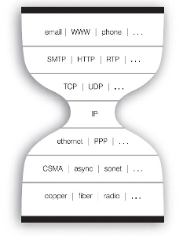
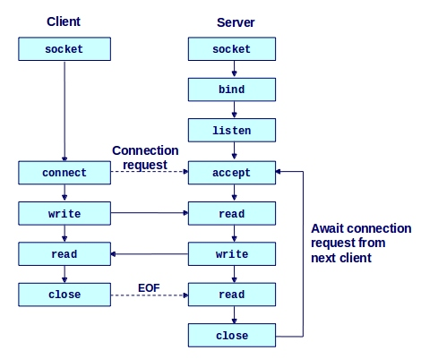

> "Сеть — это компьютер" (лозунг корпорации Sun)

Поддержка работы с сетью на первый взгляд не является функцией ядра ОС, однако на практике большинство ОС реализуют ее в ядре. Для этого есть несколько причин:

- работа с сетью нужна подавляющему большинству нетривиальных програм, поэтому логично, что ОС должна предоставить для них сетевой сервис, абстрагированный от разнородных аппаратных средств и низкоуровневых протоколов поддержки соединения

> Любая программа стремится расшириться до тех пор, пока с его помощью не станет возможно читать почту. Те программы, которые не расширяются настолько, заменяются теми, которые расширяются. (Закон оборачивания софта Jamie Zawinski)

- работа с сетью должна быть быстрой
- ограничения безопасности, связанные с работой с сетью
- относительная простота реализации: небольшой набор стандартных протоколов, среди которых основные — это IP, TCP и UDP

Также в основе реализации компьютерных сетей лежит Принцип устойчивости (Закон Постела):

> Будьте консервативными в том, что отправляете, и либеральными в том, что принимаете от других.

### "Заблуждения" программистов про сеть

Разработка распределенных программ, использующих сеть, отличается от разработки программ, работающих на одном компьютере. Эти отличия выражены в следующем списке т.н. "заблуждений" программистов про сеть:

- сеть надежна
- расходы на транспорт нулевые
- задержка нулевая
- часы синхронизированны
- пропускная способность неограниченна
- топология сети неизменна
- сеть гомогенна
- есть только один администратор
- сеть безопасна

## Модель OSI

[Сетевая модель OSI](http://ru.wikipedia.org/wiki/%D0%A1%D0%B5%D1%82%D0%B5%D0%B2%D0%B0%D1%8F_%D0%BC%D0%BE%D0%B4%D0%B5%D0%BB%D1%8C_OSI) — это теоретическая эталонная модель сетевого взаимодействия открытых систем. В ней реализован принцип разделения забот (separation of concerns), который выражен в том, что взаимодействие происходит на 7 разных уровнях, каждый из которых отвечает за решение одной проблемы:

- 7й - Прикладной (application) — доступ к сетевым службам прикладных приложений, данные представляются в виде "запросов" (requests)
- 6й - Представления (presentation) — кодирование и шифрование данных
- 5й - Сеансовый (session) — управление сеансом связи
- 4й - Транспортный (transport) — связь между конечными пунктами (которые не обязательно связанны непосредственно) и надежность, данные представляются в виде "сегментов" (datagrams)
- 3й - Сетевой (network) — определение маршрута и логическая адресация, обеспечение связи в рамках сети, данные представляются в виде "пакетов" (packets)
- 2й - Канальный (data link) — физическая адресация, обеспечение связи точка-точка, данные представляются в виде "кадров" (frames)
- 1й - Физический (physical) — работа со средой передачи, сигналами и двоичными данными (битами)

При обеспечении связи между узлами (хостами) данные проходят процесс "погружения" с прикладного уровня на физический на отправителе и обратный процесс на получателе.

:br

## Стек протоколов TCP/IP

На практике доминирующей моделью сетевого взаимодействия является стек протоколов TCP/IP, который в целом соответствует модели OSI, однако не регламентирует обязательное наличие всех уровней в ней. Как следует из названия, обязательными протоколами в ней являются TCP (или его альтернатива UDP), а также IP, которые реализуют транспортный и сетевой уровень модели OSI.

Уровни TCP/IP стека:

- 4й - Прикладной уровень (Process/Application) — соответствует трем верхним уровням модели OSI (однако, не обязательно реализует функциональность их всех)
- 3й - Транспортный уровень (Transport) — соответствует транспортному уровню модели OSI
- 2й - Межсетевой уровень (Internet) — соответствует сетевому уровню модели OSI
- 1й - Уровень сетевого доступа (Network Access) — соответствует двум нижним уровням модели OSI

В этой модели верхний и нижний уровни включают в себя несколько уровней модели OSI и в разных случаях они могут быть реализованы как одним протоколом взаимодействия, так и несколькими (соответствующими отдельным уровням). Например, протокол HTTP реализует уровни прикладной и представления, а протокол TLS — сеансовый и представления, а в сочетании между собой они могут покрыть все 3 верхних уровня. При этом протокол HTTP работает и самостоятельно, и в этом случае, поскольку он не реализует сеансовый уровень, HTTP-соединения называют "stateless", т.е. не имеющими состояния.

Модель TCP/IP также называют песочными часами, поскольку посредине в ней находится один протокол, IP, а протоколы под ним и над являются очень разнообразными и покрывают разные сценарии использования. Стандартизация протокола посередине дает большую гибкость низкоуровневым протоколам (которая нужна из-за наличия разных способов соединения) и высокоуровневым (нужную из-за наличия разных сценариев работы).

## Интерфейс BSD сокетов

Интерфейс сокетов — это де-факто стандарт взаимодействия прикладной программы с ядром ОС — точка входа в сеть для приложения. Он соединяет прикладной уровень стека TCP/IP, который реализуется в пользовательском пространстве, с нижним уровнями, которые, как правило, реализуются в ядре ОС.

Сокеты расчитаны на работу в клиент-серверной парадигме взаимодействия: активный клиент подключается к пассивному серверу, который способен одновременно обрабатывать множество клиентских соединений. Для идентификации сервера при сокетном соединении используется пара IP-адрес—порт. **Порт** — это уникальное в рамках одного хоста число, как правило, ограниченное в диапазоне 1-65535. Порты деляться на привилегированные (1-1024), которые выделяются для приложений с разрешения администратора системы, и все остальные — доступные любым приложениям без ограничений. Большинство стандартных прикладных протоколов имеют стандартные номера портов: 80 — HTTP, 25 — SMTP, 22 — SSH, 21 — FTP, 53 — DNS. Один порт может одновременно использовать только один процесс ОС.

Сокет — это файлоподобный объект, поддерживающий следующие операции:

- создание — в результате в программе появляется соответствующий файловый дескриптор
- подключение — выполняется по-разному для клиента и сервера
- отключение
- чтение/запись
- конфигурация

Основные системные вызовы для работы с сокетами:

- `socket` — создание сокета
- `connect` — инициация клиентского соединения
- `bind` — привязка сокета к порту
- `listen` — перевод сокета в пассивный режим прослушивания порта (актуально только для TCP соединений)
- `accept` — принятие соединения от клиента (который вызвал операцию `connect`) — это блокирующая операци, которая ждет поступления нового соединения
- `read`/`write` или же `send`/`recv` — запись/чтение данных в сокет
- `recvfrom`/`sendto` — аналогичные операции для UDP сокетов
- `setsockopt` — установка параметров сокета
- `close` — закрытие сокета

Поскольку сокеты — это, фактически, интерфейс для погружения на третий уровень TCP/IP-стека, сокеты не предоставляют механизмов для управления кодированием данных и сенсами работы приложений — они просто позволяют передать "сырой" поток байт.

:br

### Общая схема взаимодействия через сокет

Как видно из схемы, на сервере для установления TCP соединения нужно выполнить 3 операции:

- `bind` захватывает порт, после чего другие процессы не смогут занять его для себя
- `listen` (для TCP соединения) переводит его в режим прослушивания, после чего клиенты могут инициировать подключения к нему
- однако, пока на сервере на выполнен `accept`, клиентские соединения будут ожидать в очереди (backlog) сокета, ограничения на которую могут быть заданы в вызове `listen`

Выполнение `accept` приводит к появлению еще одного объекта сокета, который отвечает текущему клиентскому соединению. При этом серверный сокет может принимать новые соединения.

После выполнения `accept` сервер может реализовать несколько сценариев обслуживания клиента:

- эксклюзивный вариант — обслуживание происходит в том же потоке, который выполнил `accept`, поэтому другие клиенты ждут завершения соединения в очереди
- 1 поток на соединение — сразу же после выполнения `accept` создается новый поток, куда передается появившийся сокет, и дальнейшая коммуникация происходит в этом потоке, который закрывается по завершению соединения. Тем временем сервер может принимать новые соединения. Такая схема является наиболее распространенной. Ее основной недостаток — это большие накладные расходы на каждое соединение (отдельный поток ОС)
- неблокирующий ввод-вывод — при этом в одном потоке сервер принимает соединение, а в другом потоке работает т.н. цикл событий (event loop), в котором происходит асинхронная обработка всех принятых клиентских соединений

### Неблокирующий (асинхронный) ввод-вывод

Сокеты поддерживают как синхронный, так и асинхронный ввод-вывод. Асинхронный IO является критической функцией для создания эффективных сетевых серверов. Для поддержки асинхронного ввода вывода у сокетов (как и у других файловых дескрипторов) есть параметр `O_NONBLOCK`, который можно установить с помощью системного вызова `fcntl`. После перевода файлового дескриптора в неблокирующий режим, с сокетом можно работать с помощью системных вызовов `select` и `poll`, которые позволяют для группы файловых дескрипторов узнать, какие из них готовы к чтению/записи. Альтернативой `poll` являются специфичные для отдельных систем операции, которые реализованы более эффективно, но не являются портабельными: `epoll` в Linux, `kqueue` во FreeBSD и др.

### ZeroMQ (0MQ)

Развитием парадигмы сокетных соединений за рамки модели взаимодействия клиент-сервер является технология ZeroMQ, которая предоставляет усовершенствованный интерфейс сокетов с поддержкой большего количества протоколов взаимодействия, а также с поддержкой других схем работы:

- публикация-подписка (pub-sub)
- тяни-толкай (push-pull)
- дилер-маршрутизатор (dealer-router)
- экскюзивная пара
- наконец, схема запрос-ответ (req-rep) — это классическая клиент-серверная схема соединения

См. [ZeroMQ - Super Sockets](http://www.slideshare.net/j2d2/zeromq-super-sockets-by-j2-labs)

## RPC и сетевые архитектуры

Распределенная программа использует для взаимодействия определенный протокол, который также можно рассматривать как интерфейс вызова процедур удаленно (RPC — remote procedure call). Фактически, интерфейс RPC реализует прикладной уровень модели OSI, но для его поддержки также необходимо в той или иной мере реализовать протоколы уровня представления и, иногда, сеансового уровня. Уровень представления решает задачу передачи данных в рамках гетерогенной (т.е. состоящей из различных компонент) сети в "понятной" форме. Для этого нужно учитывать такие аспекты, как старшинство байт (endianness), кодировки для текстовых данных, представления композитных данных (коллекций, структур) и т.д. Еще одной задачей RPC-уровня часто является нахождение сервисов (service discovery).

Реализация RPC может быть основана на собственном (ad hoc) или же каком-то из стандартных протоколов прикладного уровня и представления. Например, реализация RPC по методолгии REST использует стандартные протоколы HTTP в качестве транспортного и JSON/XML для представления (сериализации). XML/RPC або JSON/RPC — это ad hoc RPC, которые используют XML или JSON для представления данных. Протоколы ASN.1 и Thrift — это бинарные протоколы, которые определяют реализацию всех 3-х уровней.

В форматах сериализации существует 2 дихотомии: бинарные и текстовые форматы, а также статические (использующие схему) и динамические (без схемы, schema-less).

Распространенные форматы сериализации включают:

- JSON — текстовый динамический формат
- XML — тестовый формат с опциональной схемой
- Protocol Buffers — бинарный статический формат
- MessagePack — основанный на JSON бинарный формат
- Avro — основанный на JSON формат со схемой
- EDN (extensible data notation) — текстовый динамический формат

Сетевые приложения могут быть реализованы в виде разных сетевых архитектур. Ключевым параметром для каждой архитектуры является уровень централизации: от полностью централизованных — **клиент-сервер** — до полностью децентрализованных — **peer-to-peer**/**P2P**. Важными моделями между этими двумя крайностями является модель сервисно-ориентированной архитектуры (**SOA**), а также модель **клиент-очередь-клиент**.

## Литература

- [Tour of the Black Holes of Computing: Network Programming](http://www.cs.hmc.edu/~geoff/classes/hmc.cs105.200809/slides/class23_net2.ppt)
- [Beej's Guide to Network Programming](http://beej.us/guide/bgnet/output/html/singlepage/bgnet.html)
- [Socket System Calls](http://www.slideshare.net/AvinashVarma/socket-system-calls)
- [Мультиплексирование ввода-вывода](http://ro-che.info/docs/2011-11-29-io-multiplexing.pdf)
